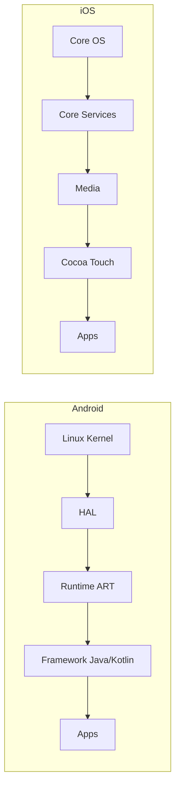

# Aula 01 - Introdução ao Desenvolvimento Mobile 📱

!!! tip "Objetivo"
    **Objetivo**: Compreender o panorama do desenvolvimento mobile, diferenciar tecnologias (Nativo, Híbrido, Web) e preparar o terreno para o desenvolvimento Android com comparações ao iOS.

---

## 1. Panorama do Mercado Mobile 🌍

O mundo hoje é _mobile-first_. Antes de codificarmos, precisamos entender onde estamos pisando. Existem basicamente três caminhos para criar um app:

### 📱 Nativo
*   **O que é**: Apps desenvolvidos na linguagem oficial da plataforma.
*   **Android**: Java ou Kotlin (usando Android Studio).
*   **iOS**: Objective-C ou Swift (usando Xcode).
*   **Vantagens**: Performance máxima, acesso total ao hardware, melhor experiência de usuário (UX).
*   **Desvantagens**: Custo mais alto (duas bases de código).

### 🌐 Web (PWA)
*   **O que é**: Sites que parecem apps. Rodam no navegador.
*   **Tecnologias**: HTML, CSS, JavaScript.
*   **Vantagens**: Rápido de fazer, funciona em tudo.
*   **Desvantagens**: Sem acesso a muitos recursos nativos, performance limitada.

### 🧩 Híbrido / Cross-Platform
*   **O que é**: Uma base de código que gera apps para ambas as plataformas.
*   **Tecnologias**: Flutter (Dart), React Native (JS), KMP (Kotlin).
*   **Vantagens**: Custo reduzido.
*   **Desvantagens**: Performance pode não ser igual à nativa em casos complexos.

!!! note "Nossa Escolha"
    Neste curso, focaremos no **Nativo (Android)**, pois é a base de tudo. Quem sabe nativo entende *como* os frameworks híbridos funcionam por baixo dos panos.

---

## 2. Ecossistema: Android vs iOS 🤖🍎

Vamos comparar os dois gigantes:

| Característica | 🤖 Android (Google) | 🍎 iOS (Apple) |
| :--- | :--- | :--- |
| **Linguagem Principal** | Kotlin (Java legado) | Swift (Obj-C legado) |
| **IDE (Ferramenta)** | Android Studio | Xcode |
| **Sistema Operacional** | Linux (Kernel modificado) | Darwin (Unix-like) |
| **Loja de Apps** | Google Play Store | Apple App Store |
| **Arquivos de App** | .apk / .aab | .ipa |
| **Publicação** | Mais flexível, taxa única ($25) | Mais rígida, taxa anual ($99) |

### Comparativo Visual (Mermaid)



---

## 3. Ferramentas de Desenvolvimento 🛠️

### Android Studio
É a IDE oficial, baseada no IntelliJ IDEA (JetBrains). Poderosa, cheia de recursos, mas... pesada.

!!! warning "Requisitos Mínimos"
    Para rodar o Android Studio confortavelmente, recomenda-se pelo menos **8GB de RAM** (ideal 16GB) e **SSD**. Sem SSD, a dor é real. 😢

### Xcode
É a IDE oficial da Apple. Só roda em macOS. É conhecida por ser um pouco mais visual no design de telas (Storyboards), embora o Android Studio tenha evoluído muito com o Layout Editor.

---

## 4. Estrutura Básica de um Projeto 📂

Quando criamos um "Hello World", o que realmente é criado?

### No Android (Gradle Project)

Use o terminal abaixo para explorar a estrutura típica:

```termynal
$ tree MyFirstApp
MyFirstApp
├── app/
│   ├── src/
│   │   ├── main/
│   │   │   ├── java/ (Código Kotlin/Java)
│   │   │   ├── res/ (Recursos: Imagens, XMLs)
│   │   │   │   ├── layout/ (Telas)
│   │   │   │   ├── values/ (Cores, Textos)
│   │   │   └── AndroidManifest.xml
│   └── build.gradle (Configurações do App)
├── build.gradle (Configurações do Projeto)
└── settings.gradle
```

### 🆚 Comparação com iOS (Xcode Project)

*   `AndroidManifest.xml` ≈ `Info.plist` (Configurações essenciais e permissões).
*   `res/layout/*.xml` ≈ `.storyboard` ou `.xib` (Arquivos de interface).
*   `build.gradle` ≈ `project.pbxproj` (mas muito mais legível e editável!).

---

## 5. Por que Kotlin? E o Java? 🤔

O Android nasceu com **Java**. É uma linguagem robusta, mas verbosa.
Em 2017, o Google anunciou **Kotlin** como linguagem oficial.

*   **Java**:
    *   Verbo: `System.out.println("Olá");`
    *   NullpointerException: O pesadelo dos devs. 👻
*   **Kotlin**:
    *   Conciso: `println("Olá")`
    *   Null Safety: O compilador te protege de valores nulos! 🛡️

!!! tip "Dica de Mestre"
    Aprenderemos **Java** nas próximas aulas para ter base sólida, e depois migraremos para **Kotlin**, que é o padrão moderno. Isso te tornará um desenvolvedor completo, capaz de manter sistemas legados e criar novos.

---

## 6. Mini-Projeto: Configurando o Ambiente 🚀

Sua missão para a próxima aula não é codar, é preparar o terreno.

1.  Baixar e instalar o **Android Studio** (Ladybug ou versão mais recente).
2.  Baixar e instalar o **JDK 17** ou **21** (Java Development Kit).
3.  Configurar as **Variáveis de Ambiente** (JAVA_HOME).

> Veja o passo a passo detalhado na seção [Configuração > Setup Android](../setups/setup-01.md).

---

## 7. Exercício de Fixação 🧠

Para fixar os conceitos de hoje, responda:

1.  Qual a principal diferença de custo de publicação entre Google Play e App Store?
2.  Se eu quiser um app que acesse o Bluetooth de forma extremamente performática, devo escolher Nativo ou Web? Por que?
3.  O que é o `AndroidManifest.xml` e qual seu equivalente no iOS?

---

**Próxima Aula**: Vamos colocar a mão na massa com [Fundamentos de Java para Android](./aula-02.md)! ☕
