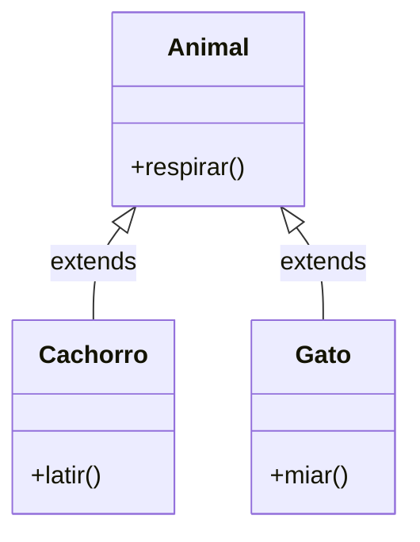

# Aula 02 - Fundamentos de Java para Android ☕

!!! tip "Objetivo"
    **Objetivo**: Dominar a sintaxe do Java, focando nos conceitos essenciais para o desenvolvimento Android (POO) e comparando com a rigidez do Swift/iOS.

---

## 1. Por que estudar Java em 202X? 🦖

Java é a base do Android. Mesmo que você use Kotlin (o que faremos a partir da Aula 03), **todo o sistema operacional Android** e suas bibliotecas antigas foram escritos em Java.

*   Entender Java = Entender como o Android funciona "por baixo do capô".
*   Muitos projetos legados ainda usam Java.

---

## 2. A Estrutura de uma Classe 🏗️

Em Java, **tudo** é um objeto (ou quase tudo).

```java
// Nome da classe deve começar com Maiúscula (PascalCase)
public class Pessoa {
    // Atributos (Variáveis de Classe)
    String nome;
    int idade;

    // Construtor
    public Pessoa(String nome, int idade) {
        this.nome = nome;
        this.idade = idade;
    }

    // Método (Função)
    public void apresentar() {
        System.out.println("Olá, eu sou " + nome);
    }
}
```

### 🆚 Comparação com Swift (iOS)

| Característica | ☕ Java | 🐦 Swift |
| :--- | :--- | :--- |
| **Pontos e vírgulas** | Obrigatórios `;` | Opcionais (e não usados) |
| **Tipagem** | Estática e Explícita (geralmente) | Estática e Inferida (muito forte) |
| **Variáveis** | `String nome = "Ana";` | `var nome = "Ana"` |
| **Constantes** | `final String NOME = "Ana";` | `let nome = "Ana"` |

---

## 3. Tipos Primitivos e Wrappers 📦

Java tem uma peculiaridade: tipos primitivos (leves) e objetos (pesados/wrappers).

*   `int` (primitivo) vs `Integer` (classe/wrapper).
*   `double` (primitivo) vs `Double` (classe/wrapper).
*   `boolean` (primitivo) vs `Boolean` (classe/wrapper).

!!! warning "Atenção ao Null"
    Um `int` nunca pode ser `null` (padrão é 0).
    Um `Integer` pode ser `null`.
    
    Isso causa o temido **NullPointerException** se você tentar somar um `Integer` que está nulo! 💥

---

## 4. Orientação a Objetos (POO) no Android 🧬

O Android usa POO o tempo todo.

### 🧩 Herança (`extends`)
A base de tudo. Uma `Activity` (tela) é filha da classe `AppCompatActivity`.

```java
public class MinhaTela extends AppCompatActivity {
    // Herda todos os métodos de tela do Android
}
```

### 🆚 Comparação: Herança



No **iOS (Swift)**, a herança funciona igual, mas a sintaxe é `class Cachorro: Animal`.

---

## 5. Estruturas de Controle e Coleções control

### `ArrayList` vs `Array`
No Android, raramente usamos arrays fixos (`String[]`). Usamos listas dinâmicas:

```java
// Java - Verboso
ArrayList<String> lista = new ArrayList<>();
lista.add("Item 1");
lista.add("Item 2");

// Swift - Conciso
var lista = ["Item 1", "Item 2"]
```

### Loops (For-Each)

```java
for (String item : lista) {
    System.out.println(item);
}
```

---

## 6. Null Safety (O problema de 1 bilhão de dólares) 💸

Em Java, qualquer objeto pode ser nulo. Você deve verificar manualmente:

```java
if (usuario != null) {
    System.out.println(usuario.nome);
}
```

Em **Swift** (e Kotlin), o sistema de tipos impede isso por padrão.

---

## 7. Exercício Prático (Mental) 🧠

Imagine que você está migrando um código iOS para Android.

**Código Swift:**
```swift
let idade: Int = 25
if idade >= 18 {
    print("Maior")
}
```

**Como ficaria em Java?**

??? success "Resposta"
    ```java
    final int idade = 25; // ou apenas int
    if (idade >= 18) {
        System.out.println("Maior");
    }
    ```

---

## 8. Desafio: A Classe 'Carro' 🚗

1.  Crie uma classe `Carro` em Java.
2.  Adicione atributos `modelo` (String) e `ano` (int).
3.  Crie um método `ligarMotor()` que imprime "Vrum!".
4.  No método `main`, instancie 2 carros diferentes.

---

**Próxima Aula**: Chega de verbosidade! Vamos conhecer o **Kotlin**, a linguagem moderna do Android e prima do Swift. [Introdução ao Kotlin](./aula-03.md) 🚀