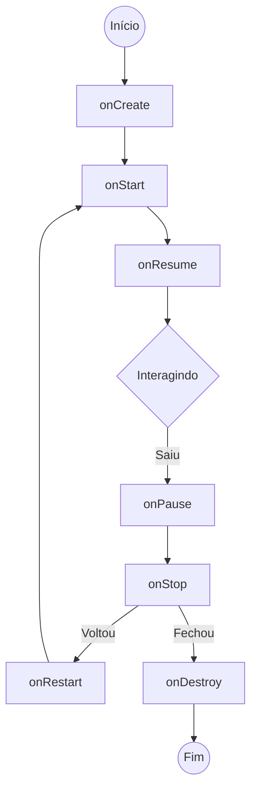

# Aula 04 - Estrutura de um App Android 🏗️

!!! tip "Objetivo"
    **Objetivo**: Entender a anatomia de um projeto Android, o ciclo de vida de uma Activity e como o XML desenha a tela.

---

## 1. O Manifesto (AndroidManifest.xml) 📜

É a certidão de nascimento do App.
*   Define o nome e ícone do app.
*   Lista as **Activities** (Telas).
*   Pede **Permissões** (Internet, Câmera, GPS).

```xml
<manifest ...>
    <uses-permission android:name="android.permission.INTERNET" />

    <application ...>
        <activity android:name=".MainActivity" android:exported="true">
            <intent-filter>
                <action android:name="android.intent.action.MAIN" />
                <category android:name="android.intent.category.LAUNCHER" />
            </intent-filter>
        </activity>
    </application>
</manifest>
```

### 🆚 Comparação: Info.plist (iOS)
No iOS, o `Info.plist` tem função similar, definindo permissões e configurações de inicialização.

---

## 2. Activity: A Tela de Verdade 🖼️

Uma `Activity` é uma classe que controla uma tela. Ela não *é* a tela (visual), ela *controla* a tela.

```kotlin
class MainActivity : AppCompatActivity() {
    override fun onCreate(savedInstanceState: Bundle?) {
        super.onCreate(savedInstanceState)
        setContentView(R.layout.activity_main) // Liga o XML da tela
    }
}
```

### 🆚 Comparação: UIViewController (iOS)
`Activity` ≈ `UIViewController`. Ambos gerenciam o ciclo de vida da tela e a interação com o usuário.

---

## 3. O Ciclo de Vida (Lifecycle) 🔄

Uma Activity nasce, vive e morre. O Android avisa a Activity quando isso acontece.

*   `onCreate()`: Nasceu. Configure a tela aqui. (Só roda 1 vez).
*   `onStart()`: Ficou visível.
*   `onResume()`: Usuário pode interagir.
*   `onPause()`: Perdeu o foco (ex: um diálogo abriu).
*   `onStop()`: Não está mais visível (ex: usuário foi pra Home).
*   `onDestroy()`: Morreu. Libere memória.



### 🆚 Comparação: iOS Lifecycle
*   `onCreate` ≈ `viewDidLoad`
*   `onStart` ≈ `viewWillAppear`
*   `onResume` ≈ `viewDidAppear`

---

## 4. Layouts XML: Desenhando a UI 🎨

O Android separa a Lógica (Kotlin) do Layout (XML).

Arquivos ficam em `res/layout/`.

```xml
<!-- LinearLayout: Organiza itens em fila (Vertical ou Horizontal) -->
<LinearLayout
    android:orientation="vertical"
    android:layout_width="match_parent"
    android:layout_height="match_parent">

    <TextView
        android:text="Olá, Android!"
        android:layout_width="wrap_content"
        android:layout_height="wrap_content" />

    <Button
        android:text="Clique aqui"
        android:layout_width="wrap_content"
        android:layout_height="wrap_content" />

</LinearLayout>
```

### 🆚 Comparação: XIBs e Storyboards
No iOS, usamos arquivos `.xib` ou `.storyboard`, mas o XML interno é ilegível para humanos. No Android, editar o XML na mão é comum e poderoso!

---

## 5. ViewBinding: Chega de `findViewById` 🔗

Antigamente, para pegar um botão no código:
```java
Button botao = findViewById(R.id.meu_botao); // Lento e perigoso (pode ser null)
```

Hoje, usamos **ViewBinding**:
```kotlin
binding.meuBotao.text = "Novo Texto" // Seguro e rápido
```

O ViewBinding gera uma classe que conecta o XML ao Kotlin automaticamente.

---

## 6. Resources (R.) 📦

Tudo que não é código fica na pasta `res`:
*   `res/drawable`: Imagens, ícones.
*   `res/values`: Cores, Strings (textos traduzíveis), Temas.

> **Regra de Ouro**: Nunca coloque texto fixo ("Hardcoded") no código ou XML. Use `@string/meu_texto`.

---

## 7. Desafio: O Ciclo da Vida Real 🧬

**Cenário**: O usuário está preenchendo um formulário no seu app. Ele recebe uma ligação.
1.  Qual método do ciclo de vida é chamado quando a ligação toca (e cobre a tela)?
2.  O que acontece se o Android estiver sem memória enquanto ele atende a ligação?

??? success "Resposta"
    1.  `onPause()` e depois `onStop()`.
    2.  O Android pode matar o processo da Activity (`onDestroy()` pode nem ser chamado!). Por isso devemos salvar os dados no `onSaveInstanceState()` ou ViewModel.

---

**Próxima Aula**: Vamos deixar o app bonito! [Interface Gráfica (Layouts e Views)](./aula-05.md) 🖌️