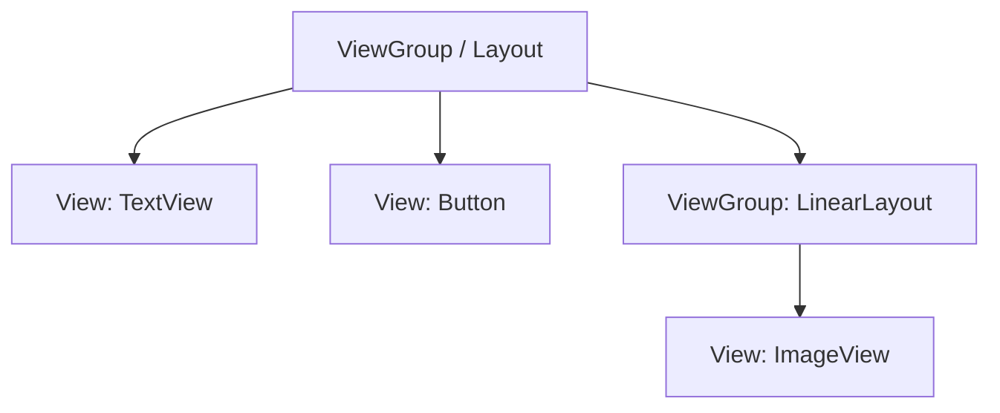

# Aula 05 - Interface Gráfica (UI) 🎨

!!! tip "Objetivo"
    **Objetivo**: Entender o sistema de Layouts do Android, diferenciar ViewGroups de Views e criar telas complexas usando ConstraintLayout e LinearLayout.

---

## 1. Views e ViewGroups 🧱

No Android, tudo que você vê é uma `View` (Botão, Texto, Imagem).
Tudo que organiza as Views é um `ViewGroup` (Layout).



### Principais Componentes (Views)
*   `TextView`: Exibe texto (Label).
*   `EditText`: Entrada de texto (Input).
*   `Button`: Botão clicável.
*   `ImageView`: Exibe imagens.
*   `CheckBox` / `RadioButton`: Seleção.

---

## 2. Layouts Fundamentais 📐

### A. LinearLayout (Simples e Rápido)
Organiza itens em uma única direção: **Vertical** ou **Horizontal**.

```xml
<LinearLayout
    android:orientation="vertical" ...>
    <Button android:text="Botão 1" />
    <Button android:text="Botão 2" />
</LinearLayout>
```
*   **Peso (`layout_weight`)**: Define quanto espaço o componente ocupa proporcionalmente.

### B. FrameLayout (Empilhamento)
Coloca uma View em cima da outra (estilo "sanduíche"). Usado para overlays.

### C. ConstraintLayout (O Poderoso) 💪
O padrão moderno. Permite criar layouts complexos e responsivos sem aninhamento excessivo ("flat hierarchy").
Funciona com "amarras" (constraints):
*   *O botão A fica à direita do botão B e abaixo do Texto C.*

```xml
<Button
    app:layout_constraintTop_toBottomOf="@+id/textoTitulo"
    app:layout_constraintStart_toStartOf="parent"
    app:layout_constraintEnd_toEndOf="parent" />
```

### 🆚 Comparação: Auto Layout (iOS)
`ConstraintLayout` é muito similar ao **Auto Layout** no iOS. Ambos usam âncoras e restrições para definir posição e tamanho relativo.

---

## 3. Unidades de Medida: `dp` e `sp` 📏

Nunca use `px` (pixels)! O Android roda em milhares de telas diferentes.

*   **dp (Density-independent Pixels)**: Para **tamanho de componentes** e margens. 1dp é aproximadamente 1/160 polegada.
*   **sp (Scale-independent Pixels)**: Para **tamanho de fonte**. Respeita a configuração de acessibilidade do usuário (se ele aumentou a fonte do sistema).

> **Regra**: Largura/Altura/Margem = `dp`. Texto = `sp`.

---

## 4. Estilos e Temas (Themes) 💅

Para não repetir código (ex: todo botão ser azul), usamos estilos.
Arquivo: `res/values/themes.xml` (ou `styles.xml`).

```xml
<style name="BotaoPadrao" parent="Widget.MaterialComponents.Button">
    <item name="android:backgroundTint">@color/purple_500</item>
    <item name="android:textSize">16sp</item>
</style>
```

No layout: `style="@style/BotaoPadrao"`

---

## 5. ViewBinding na Prática 🔗

Vamos ligar o XML ao Kotlin.
Suponha um `activity_login.xml` com um `EditText` (`edtEmail`) e um `Button` (`btnLogin`).

```kotlin
class LoginActivity : AppCompatActivity() {
    private lateinit var binding: ActivityLoginBinding

    override fun onCreate(savedInstanceState: Bundle?) {
        super.onCreate(savedInstanceState)
        binding = ActivityLoginBinding.inflate(layoutInflater)
        setContentView(binding.root)

        binding.btnLogin.setOnClickListener {
            val email = binding.edtEmail.text.toString()
            if (email.isNotBlank()) {
                // Fazer login
            } else {
                binding.edtEmail.error = "Digite o e-mail!"
            }
        }
    }
}
```

---

## 6. Eventos de Clique (Listeners) 🖱️

O jeito clássico de detectar toque: `OnClickListener`.

Em **Swift (iOS)**, usamos `@IBAction` arrastando do Storyboard ou `addTarget` via código. O conceito é o mesmo: uma função que reage a um evento.

---

## 7. Exercício Prático: Tela de Login 📝

Crie uma tela de login simples:
1.  `ConstraintLayout` como raiz.
2.  `ImageView` (Logo) no topo, centralizado.
3.  `TextInputLayout` + `TextInputEditText` para E-mail (Abaixo da logo).
4.  `TextInputLayout` + `TextInputEditText` para Senha (Abaixo do e-mail).
5.  `Button` "Entrar" (Largo, `match_parent` ou preenchendo largura com margens).
6.  `TextView` "Esqueci a senha" (Abaixo do botão).

> **Dica**: Use o *Design Editor* do Android Studio para arrastar e soltar as constraints!

---

**Próxima Aula**: Como sair dessa tela e ir para outra? [Navegação entre Telas](./aula-06.md) 🗺️