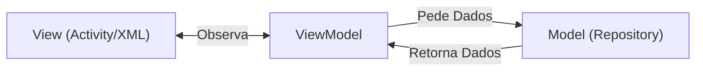

# Aula 07 - Arquitetura Moderna (MVVM) 🏗️

!!! tip "Objetivo"
    **Objetivo**: Entender por que não devemos colocar toda a lógica na Activity (God Class) e aprender o padrão MVVM (Model-View-ViewModel), recomendado pelo Google.

---

## 1. O Problema da "God Activity" 🦸‍♂️

Se você colocar lógica de banco de dados, validação, chamadas de API e controle de UI tudo na `MainActivity`, ela vai virar um monstro de 2.000 linhas.
*   Dificil de testar.
*   Dificil de manter.
*   Perde dados ao girar a tela (rotação destrói a Activity).

---

## 2. O Padrão MVVM 📐

Separamos as responsabilidades em 3 camadas:

1.  **Model**: Dados e Lógica de Negócio (Banco, API, Classes de Dados).
2.  **View**: UI (Activity/Fragment/XML). Só exibe dados e captura cliques. Não pensa!
3.  **ViewModel**: O cérebro da tela. Guarda o estado (dados) e sobrevive à rotação de tela.



### 🆚 Comparação: MVC (iOS Clássico) vs MVVM
No iOS antigo (MVC), a `ViewController` fazia o papel de View e Controller, sofrendo do mesmo problema ("Massive View Controller"). Hoje, iOS também usa muito MVVM (com SwiftUI ou UIKit).

---

## 3. ViewModel e LiveData 📡

### ViewModel
Classe que herda de `androidx.lifecycle.ViewModel`.

```kotlin
class MainViewModel : ViewModel() {
    // LiveData: Um dado observável
    val textoBemVindo = MutableLiveData<String>()

    fun carregarDados() {
        // Simula busca de dados
        textoBemVindo.value = "Olá, Aluno!"
    }
}
```

### LiveData
É um container de dados que respeita o ciclo de vida. A View "observa" o LiveData. Se a View morrer (onDestroy), ela para de observar automaticamente.

---

## 4. Conectando na Activity (View) 🔌

```kotlin
class MainActivity : AppCompatActivity() {
    // 1. Instanciar o ViewModel (forma moderna)
    private val viewModel: MainViewModel by viewModels()
    private lateinit var binding: ActivityMainBinding

    override fun onCreate(savedInstanceState: Bundle?) {
        super.onCreate(savedInstanceState)
        binding = ActivityMainBinding.inflate(layoutInflater)
        setContentView(binding.root)

        // 2. Observar o LiveData
        viewModel.textoBemVindo.observe(this) { novoTexto ->
            // Toda vez que o valor mudar, isso roda automaticamente!
            binding.txtTitulo.text = novoTexto
        }

        binding.btnCarregar.setOnClickListener {
            viewModel.carregarDados()
        }
    }
}
```

---

## 5. Vantagens do MVVM

1.  **Rotação de Tela**: Se girar o celular, a Activity morre e recria. O ViewModel **NÃO** morre. Os dados continuam lá (`novoTexto` já estará carregado).
2.  **Testabilidade**: É fácil testar o ViewModel sem precisar de emulador Android.
3.  **Separação**: O designer mexe no XML, o dev mexe no ViewModel.

---

## 6. Data Binding (O próximo nível) 🧬

Podemos ligar o XML direto no ViewModel, sem nem precisar de código na Activity para atualizar textos.

XML:
```xml
<TextView
    android:text="@{viewModel.textoBemVindo}" ... />
```
*(Não aprofundaremos Data Binding agora, focaremos no ViewBinding + LiveData/Flow)*.

---

## 7. Desafio: Contador MVVM 🔢

Crie um app "Contador de Cliques".
1.  **Sem MVVM**: Variável `count` na Activity. Gire a tela. O contador zera? (Sim).
2.  **Com MVVM**: Mova a variável `count` para um ViewModel (`MutableLiveData<Int>`).
    *   Botão chama `viewModel.incrementar()`.
    *   Activity observa e atualiza o TextView.
    *   Gire a tela. O contador zera? (Não! 🤩).

---

**Próxima Aula**: Onde guardar esses dados para sempre? [Persistência de Dados](./aula-08.md) 💾