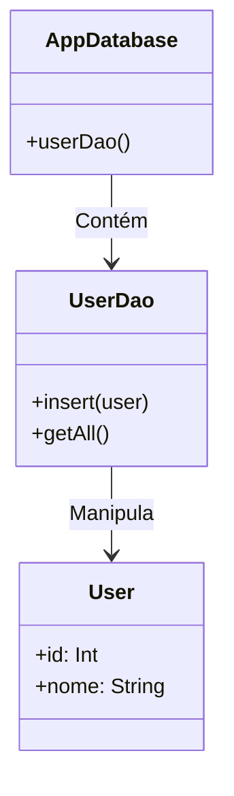

# Aula 08 - Persistência de Dados 💾

!!! tip "Objetivo"
    **Objetivo**: Aprender a salvar dados localmente no dispositivo, desde preferências simples (SharedPreferences) até banco de dados estruturado (Room/SQLite).

---

## 1. Tipos de Armazenamento Local

1.  **SharedPreferences**: Chave-Valor. Para configurações simples (Ex: "Modo Escuro ativado", "Nome do Usuário").
2.  **Banco de Dados (SQLite/Room)**: Dados estruturados, relacionais. (Ex: Lista de tarefas, cache de produtos offline).
3.  **Arquivos**: Fotos, PDF, áudios.

---

## 2. SharedPreferences 🔑

Simples, rápido, mas limitado.

```kotlin
// Gravar
val prefs = getSharedPreferences("minhas_config", Context.MODE_PRIVATE)
prefs.edit().putString("username", "Ricardo").apply()

// Ler
val usuario = prefs.getString("username", "Visitante") // Valor padrão
```

### 🆚 Comparação: UserDefaults (iOS)
No iOS, o equivalente exato é o `UserDefaults.standard`. Mesma lógica de chave-valor para configurações leves.

---

## 3. Banco de Dados: SQLite e Room 🏛️

O Android vem com SQLite embutido. Mas usar SQLite puro (SQL cru) é verboso e propenso a erros.
O Google criou o **Room**, uma biblioteca que facilita o uso do SQLite (faz parte do Jetpack).

### Arquitetura do Room

1.  **Entity**: A tabela (Classe de dados).
2.  **DAO (Data Access Object)**: Os comandos (Insert, Select, Delete).
3.  **Database**: O ponto de acesso principal.



---

## 4. Implementando o Room 🔨

### Passo 1: Entity (Tabela)
```kotlin
@Entity(tableName = "tarefas")
data class Tarefa(
    @PrimaryKey(autoGenerate = true) val id: Int = 0,
    val titulo: String,
    val concluida: Boolean
)
```

### Passo 2: DAO (comandos)
```kotlin
@Dao
interface TarefaDao {
    @Insert
    suspend fun inserir(tarefa: Tarefa)

    @Query("SELECT * FROM tarefas")
    fun listarTodas(): LiveData<List<Tarefa>>
}
```

### Passo 3: Database
```kotlin
@Database(entities = [Tarefa::class], version = 1)
abstract class AppDatabase : RoomDatabase() {
    abstract fun tarefaDao(): TarefaDao
}
```

---

## 5. Threads e Room: OBRIGATÓRIO 🧵

O Room **proíbe** acesso ao banco na Thread Principal (UI Thread). Se você tentar ler/gravar na thread principal, o app trava a tela.
Por isso usamos `suspend fun` (Coroutines) ou `LiveData` (Async).

*(Veremos Coroutines a fundo na Aula 11, mas o Room já nos força a usar ou aceitar o padrão assíncrono).*

---

## 6. Comparação: Core Data / SwiftData (iOS)

*   **SQLite/Room** (Android): Mais próximo do SQL tradicional. Você cria as queries.
*   **Core Data** (iOS): Um framework de grafo de objetos, muito poderoso mas complexo. Abstrai totalmente o banco.
*   **SwiftData** (iOS Novo): Mais parecido com o Room, usa macros e é bem simples.

---

## 7. Desafio: Lista de Compras Persistente 🛒

Crie um app simples com:
1.  Um `EditText` e um `Button` "Adicionar".
2.  Ao clicar, salva o item no Room.
3.  (Bônus) Exiba a quantidade de itens salvos em um `TextView`.
4.  Feche o app e abra de novo. Os itens devem continuar lá!

---

**Próxima Aula**: Como exibir essa lista de compras de forma eficiente? [Listas e RecyclerView](./aula-09.md) 📋