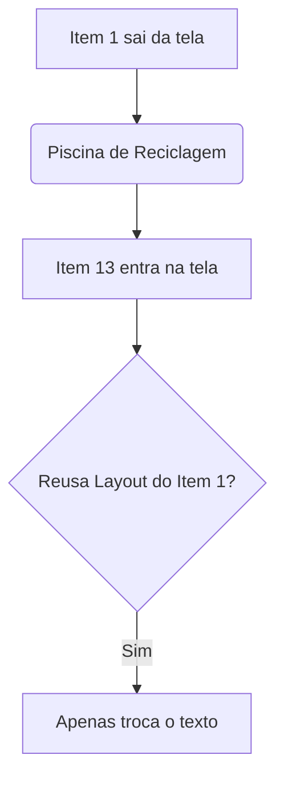

# Aula 09 - Listas Eficientes (RecyclerView) 📋

!!! tip "Objetivo"
    **Objetivo**: Dominar a criação de listas de alta performance com RecyclerView, entender o padrão Adapter/ViewHolder e lidar com cliques em itens.

---

## 1. O Problema da ListView Antiga 🐢

Antigamente, usávamos `ListView`. Ela criava uma View para **cada** item da lista.
Se você tivesse 1.000 contatos, ela tentava criar 1.000 layouts. Resultado: travamentos e consumo absurdo de memória.

---

## 2. A Solução: Reciclagem de Views ♻️

O **RecyclerView** nasceu para ser inteligente.
Se cabem 10 itens na tela, ele cria ~12 Views.
Quando você rola para baixo, o item que saiu do topo (Item 1) é **reciclado** e volta para baixo para exibir o Item 13.
Apenas o *conteúdo* (texto/imagem) muda, a *View* é reaproveitada.



### 🆚 Comparação: UITableView (iOS)
O mecanismo é idêntico ao `dequeueReusableCell` do `UITableView` no iOS.
*   Android: `RecyclerView` + `Adapter` + `ViewHolder`
*   iOS: `UITableView` + `DataSource` + `UITableViewCell`

---

## 3. Os 3 Mosqueteiros do RecyclerView ⚔️

Para fazer funcionar, precisamos de 3 peças:

1.  **LayoutManager**: Define como organizar (Lista vertical? Grade? Carrossel?).
2.  **Adapter**: O cérebro. Pega os dados e coloca nas Views.
3.  **ViewHolder**: A gaveta. Guarda as referências dos componentes (`findViewById`) para não buscar toda hora.

### Implementação do Adapter

```kotlin
class ContatoAdapter(private val lista: List<Contato>) : 
    RecyclerView.Adapter<ContatoAdapter.ViewHolder>() {

    // 1. Cria a gaveta (Layout)
    override fun onCreateViewHolder(parent: ViewGroup, viewType: Int): ViewHolder {
        val view = LayoutInflater.from(parent.context)
            .inflate(R.layout.item_contato, parent, false)
        return ViewHolder(view)
    }

    // 2. Preenche a gaveta com dados (Reciclagem)
    override fun onBindViewHolder(holder: ViewHolder, position: Int) {
        holder.bind(lista[position])
    }

    // 3. Quantos itens tem?
    override fun getItemCount() = lista.size

    // A Gaveta
    class ViewHolder(itemView: View) : RecyclerView.ViewHolder(itemView) {
        fun bind(contato: Contato) {
            itemView.findViewById<TextView>(R.id.txtNome).text = contato.nome
        }
    }
}
```

---

## 4. LayoutManagers: Flexibilidade Total 🤸

Apenas trocando uma linha, você muda a cara da lista:

*   **LinearLayoutManager**: Lista padrão (Vertical ou Horizontal).
*   **GridLayoutManager**: Grade (Ex: Galeria de fotos).
*   **StaggeredGridLayoutManager**: Grade assimétrica (Ex: Pinterest).

```kotlin
recyclerView.layoutManager = GridLayoutManager(this, 2) // 2 colunas
```

---

## 5. Lidando com Cliques 👆

O RecyclerView não tem `OnItemClickListener` nativo fácil como a ListView.
Geralmente passamos uma função (lambda) para o Adapter.

**No Adapter:**
```kotlin
class ContatoAdapter(
    private val lista: List<Contato>,
    private val onClick: (Contato) -> Unit // Callback
) ... {
    
    override fun onBindViewHolder(...) {
        holder.itemView.setOnClickListener { 
            onClick(lista[position]) 
        }
    }
}
```

**Na Activity:**
```kotlin
val adapter = ContatoAdapter(meusContatos) { contatoClicado ->
    Toast.makeText(this, "Cliquei em ${contatoClicado.nome}", Toast.LENGTH_SHORT).show()
}
```

---

## 6. ListAdapter e DiffUtil (Otimização Máxima) 🚀

Se você alterar um item da lista e chamar `notifyDataSetChanged()`, ele redesinha TUDO. Isso é lento.
O **DiffUtil** compara a lista velha com a nova e atualiza só o que mudou (animação bonita de inserção/remoção).

O **ListAdapter** é uma classe do Jetpack que já implementa DiffUtil pra você de graça. Sempre prefira usar `ListAdapter` em vez de `RecyclerView.Adapter` puro em projetos reais.

---

## 7. Desafio: Catálogo de Filmes 🎬

1.  Crie um layout `item_filme.xml` com Imagem (Cartaz) e Texto (Título).
2.  Crie um Adapter para exibir uma lista de 10 filmes falsos.
3.  Use `GridLayoutManager` com 2 colunas.
4.  Ao clicar no filme, abra uma `DetalhesActivity` passando o título do filme.

---

**Próxima Aula**: Vamos preencher essa lista com dados reais da internet? [Consumo de API REST](./aula-10.md) 🌍