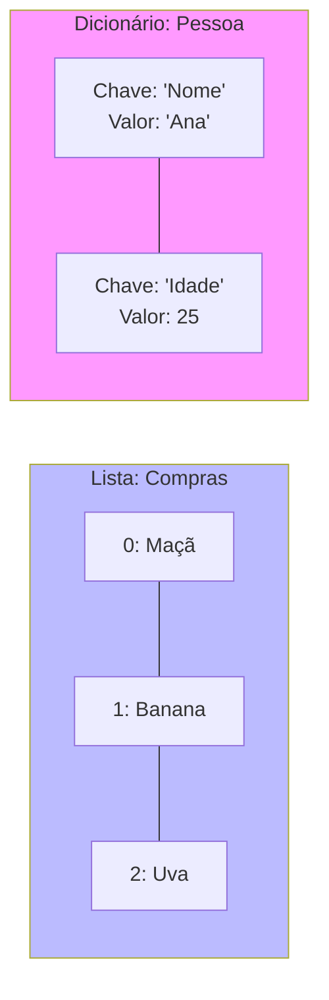

# Aula 13 - Python e Ciência de Dados 🐍

!!! tip "Objetivo"
    **Objetivo**: Programar rápido, com poucas linhas e muita clareza. A linguagem favorita da IA e Data Science.

---

## 1. Por que Python? 🚀

Python lê-se como inglês. Não usa chaves `{}` nem ponto-e-vírgula `;`. Usa **Indentação** (espaços).

```python
# Em Python
if idade >= 18:
    print("Maior")
else:
    print("Menor")
```

### Visualizando Estruturas de Dados (Mermaid)

Python brilha com **Listas** e **Dicionários**.



---

## 2. Dicionários: A Chave do Sucesso 🔑

Em C ou Java, usamos vetores. Em Python, usamos Dicionários (Chave: Valor). É extremamente rápido.

```python
pessoa = {
    "nome": "Ana",
    "idade": 25,
    "skills": ["Python", "SQL"]
}

print(pessoa["nome"]) # Ana
```

---

## 3. Python Interativo (REPL) ⌨️

Python é interpretado. Você pode testar ideias na hora.

<div data-termynal class="termy">
    <span data-ty="input">python</span>
    <span data-ty>>>> 2 + 2</span>
    <span data-ty>4</span>
    <span data-ty>>>> nome = "Ric"</span>
    <span data-ty>>>> print(nome * 3)</span>
    <span data-ty>RicRicRic</span>
    <span data-ty>>>> exit()</span>
</div>

</div>

### Executando Arquivos (.py)
Para programas grandes, não usamos o REPL. Criamos um arquivo `app.py`:

```python
# app.py
print("Iniciando sistema...")
nome = input("Digite seu nome: ")
print(f"Bem-vindo, {nome}!")
```

E rodamos no terminal:
`<span class="termy">python app.py</span>`

---

## 4. O Poder das Bibliotecas (Data Science) 📊

Python tem bibliotecas para tudo.
*   **Pandas**: Excel com esteroides.
*   **Matplotlib**: Gráficos.

```python
import pandas as pd
# dados = pd.read_csv("vendas.csv")
# print(dados.describe())
```

---

## 5. Exercícios de Fixação 📝

1.  **Fácil**: Crie uma lista com 5 frutas e imprima a terceira.
2.  **Médio**: Crie um dicionário para um `Carro` (marca, modelo, ano). Imprima "Meu carro é um [Modelo] de [Ano]".
3.  **Desafio (Análise)**: Dada a lista `notas = [5.5, 8.0, 9.5, 4.0]`, use funções do Python (`sum`, `len`) para calcular a média e dizer se passou (Média >= 6).

---
**Próxima Aula**: Performance extrema e segurança de memória com [Rust e Go](./aula-14.md).