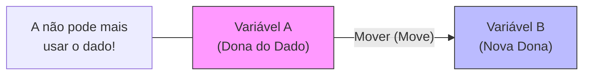
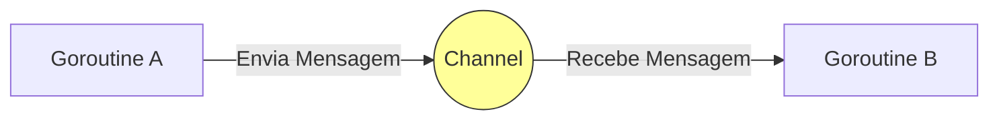

# Aula 14 - Sistemas Modernos: Rust e Go 🦀🐹

!!! tip "Objetivo"
    **Objetivo**: Conhecer as linguagens que estão substituindo o C/C++ na infraestrutura da computação moderna.

---

## 1. Rust: Segurança Sem Custo 🦀

Rust garante que você não cometa erros de memória (sem telas azuis!), mas roda tão rápido quanto C.
O segredo? **Ownership** (Propriedade).

### Visualizando Ownership (Mermaid)



```rust
let a = String::from("Olá");
let b = a; // 'a' moveu para 'b'
// println!("{}", a); // ERRO! 'a' não existe mais.
```

---

## 2. Go: Simplicidade e Concorrência 🐹

Criada pelo Google para ser simples. Famosa pelas **Goroutines** (tarefas leves).

### Visualizando Channels (Canais)
Em Go, threads não brigam por memória. Elas conversam por canais.



```go
mensagens := make(chan string)

go func() { mensagens <- "Ping" }() // Envia
msg := <-mensagens // Recebe
fmt.Println(msg)
```

---

## 3. Simulando Execução (Termynal)

<div data-termynal class="termy">
    <span data-ty="input">cargo run</span>
    <span data-ty="progress">Compiling projeto_rust v0.1.0</span>
    <span data-ty="progress">Running `target/debug/projeto_rust`</span>
    <span data-ty>Segurança garantida!</span>
    <span data-ty="input">go run main.go</span>
    <span data-ty>Simplicidade e Performance!</span>
</div>

---

## 4. Exercícios de Fixação 📝

1.  **Fácil (Go)**: Faça um "Olá Mundo" em Go.
2.  **Médio (Rust)**: Crie uma função que receba uma String, calcule o tamanho e retorne os dois (tupla). (Entenda como Rust lida com retorno).
3.  **Desafio (Go)**: Crie duas Goroutines. Uma imprime "Tick", a outra "Tack". Tente fazê-las rodar juntas.

---
**Próxima Aula**: Do servidor para o bolso. Desenvolvimento Mobile com [Dart e Kotlin](./aula-15.md).