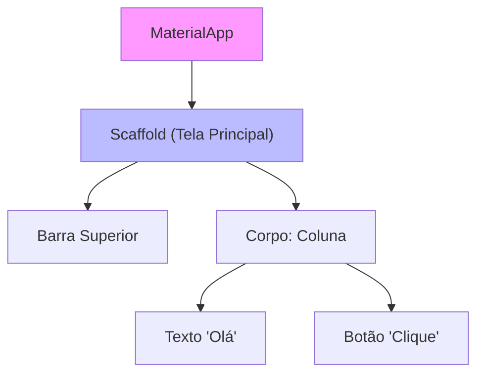
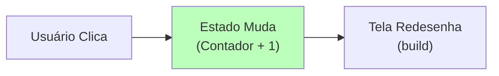

# Aula 15 - Desenvolvimento Mobile: Dart e Kotlin 📱

!!! tip "Objetivo"
    **Objetivo**: Criar aplicativos que rodam no seu bolso. Entenda a diferença entre **Nativo** e **Multiplataforma**.

---

## 1. O Mundo Mobile 🌍

Existem dois reis: **Android** (Google) e **iOS** (Apple).
Para criar apps, temos dois caminhos:

1.  **Nativo**: Escreve um código para cada (Kotlin para Android, Swift para iOS). Melhor performance, mas dobro do trabalho.
2.  **Multiplataforma**: Escreve um código (Dart/Flutter, React Native) que roda nos dois.

### Visualizando a Árvore de Widgets (Flutter/Mermaid)
Em Flutter, TUDO é um Widget (um pedaço da tela). Eles se organizam como uma árvore.



---

## 2. Dart e Flutter 💙

Dart é a linguagem. Flutter é o framework (ferramenta).

```dart
import 'package:flutter/material.dart';

void main() {
  runApp(MeuApp());
}

class MeuApp extends StatelessWidget {
  @override
  Widget build(BuildContext context) {
    return MaterialApp(
      home: Scaffold(
        appBar: AppBar(title: Text("Meu Primeiro App")),
        body: Center(child: Text("Olá, Flutter!")),
      ),
    );
  }
}
```

### Simulando o Build (Termynal)

<div data-termynal class="termy">
    <span data-ty="input">flutter create meu_app</span>
    <span data-ty="progress">Criando projeto...</span>
    <span data-ty="input">flutter run</span>
    <span data-ty="progress">Compilando para Android...</span>
    <span data-ty="progress">Instalando no emulador...</span>
    <span data-ty="progress">Aplicativo rodando!</span>
</div>

### 3. Gerenciando Estado (O Interativo) ⚡

Aplicativos não são estáticos. Se você clica num botão e a tela muda, o **Estado** mudou.



---

## 4. Kotlin: O Poder do Android Nativo 🤖

Kotlin é moderno, conciso e 100% compatível com Java. É a linguagem oficial do Google para Android.

```kotlin
fun main() {
    val nome = "Android"
    println("Olá, $nome!")
}
```

---

## 4. Exercícios de Fixação 📝

1.  **Fácil (Dart)**: Crie uma função em Dart que receba uma lista de preços e retorne o total.
2.  **Médio (Flutter Conceitual)**: Desenhe a árvore de widgets da tela de login do Instagram (Logo, Campo Email, Campo Senha, Botão Entrar).
3.  **Desafio (Kotlin)**: Crie uma classe `Celular` com método `ligar()`. Se a bateria estiver vazia, mostre erro.

---
**Próxima Aula**: Voltando para onde tudo começou (e onde a internet vive). [PHP e o Legado Web](./aula-16.md).