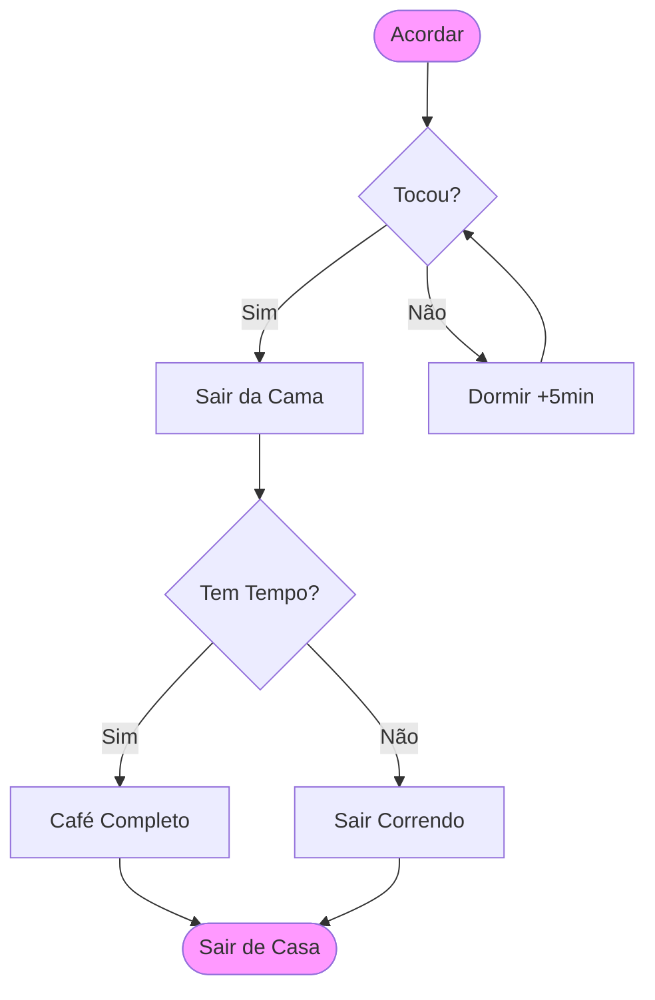

# Projeto 01 - Fluxograma da Vida (Milestone 1) 🧬

## O Desafio 🎯
Você foi contratado para mapear processos de uma empresa. Antes de mexer com sistemas complexos, você precisa treinar com sua própria rotina.

**Objetivo**: Criar um **Fluxograma** detalhado de uma rotina diária, exercitando a decomposição e tomada de decisão.

## Cenário
Mapeie o processo de **"Acordar e ir para o Trabalho/Escola"**.

### Requisitos Obrigatórios
1.  **Início/Fim**: Ovalos bem definidos.
2.  **Ações**: "Levantar", "Escovar Dentes", "Tomar Café".
3.  **Decisões** (Pelo menos 3):
    - "Está chovendo?" -> Sim: Levar guarda-chuva / Não: Óculos de sol.
    - "Tenho tempo?" -> Sim: Café completo / Não: Café rápido.
    - "Tem ônibus?" -> Sim: Pegar ônibus / Não: Chamar Uber.
4.  **Ferramenta**: Use Mermaid, Draw.io ou Papel.

## Exemplo (Mermaid)

## Entrega 📦
- Imagem do Fluxograma (PNG/JPG) ou código Mermaid.