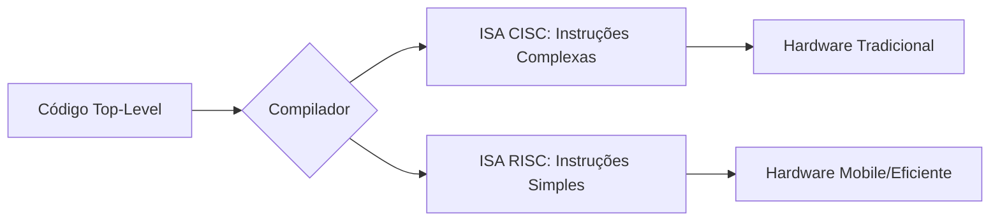

# Aula: Do Silício ao Software 🖥️
## O Ecossistema da Computação Moderna

Esta aula explora a transição entre o hardware (processadores e arquiteturas) e o software (sistemas operacionais e plataformas).

---

## 1. O Alicerce: CISC vs. RISC 🏗️

Todo software é reduzido a um **ISA** (*Instruction Set Architecture*). Existem duas filosofias principais:

*   **CISC (Complex Instruction Set Computer):** Focada em executar tarefas complexas com poucas linhas. Ex: **Intel/AMD (x86)**.
*   **RISC (Reduced Instruction Set Computer):** Usa instruções simples e ultra-rápidas. Ex: **ARM (Apple M-series, Snapdragon)**.

### Comparativo de Fluxo 📊

---

## 2. Abstração e Camadas de Software 🧠

O Sistema Operacional (SO) serve como o tradutor entre seu código e o silício.

!!! concept "Conceito: Abstração de Hardware"
    A abstração permite que você escreva `print("Hello")` sem se preocupar se o processador usa x86 ou ARM. O SO e o compilador cuidam da tradução para os binários específicos.

| Sistema Operacional | Arquitetura Principal | Desafio do Desenvolvedor |
| :--- | :--- | :--- |
| **Windows** | x86_64 / ARM64 | Compatibilidade de drivers e emulação. |
| **macOS / iOS** | ARM64 (Apple Silicon) | Otimização para memória unificada. |
| **Android** | ARM64 | Lidar com a fragmentação de hardware. |

!!! tip "Dica de Performance"
    Sempre prefira **binários nativos**. Rodar um app x86 em um Mac ARM via Rosetta 2 funciona, mas consome mais bateria e CPU.

---

## 3. Na Prática: Compilação Cruzada 💻

Quando desenvolvemos mobile, estamos quase sempre fazendo *Cross-Compilation*: escrevemos no PC (x86) para rodar no celular (ARM).

    rustup target add aarch64-apple-ios
    
    cargo build --target aarch64-apple-ios
    ✅ Build concluído para arquitetura ARM64!

---

## 4. Sistemas Embarcados e IoT 🔌

Aqui o software "toca" o metal de forma direta.

*   **Arduino:** 8 bits, extremamente simples.
*   **ESP32:** O rei da IoT com Wi-Fi/Bluetooth e dual-core RISC.
*   **Raspberry Pi:** Um computador ARM completo rodando Linux.

!!! attention "Atenção: Limites de Memória"
    Em sistemas embarcados, você não tem GBs de RAM. Cada byte conta! O uso de linguagens como C ou Rust é essencial.

---

## 📝 Exercícios Progressivos

1.  **Nível 1:** Explique a principal diferença entre um processador que equipa um Desktop (Intel) e um que equipa um Smartphone (Snapdragon).
2.  **Nível 2:** Por que a Apple conseguiu aumentar drasticamente a duração da bateria ao mudar de Intel para Apple Silicon?
3.  **Nível 3:** Pesquise o que é o "Instruction Set" RISC-V e por que ele é considerado o futuro do hardware open-source.

---

## 🚀 Mini-Projeto: Dashboard de Arquitetura

**Objetivo:** Criar um script (Python ou Node) que detecte as especificações do sistema host.

*   **Tarefa 1:** Identificar o nome do SO e a arquitetura da CPU (`x86_64` ou `arm64`).
*   **Tarefa 2:** Listar a quantidade de núcleos físicos vs lógicos.
*   **Tarefa 3:** Exibir uma recomendação de build (Nativo vs Emulado) com base nos dados.

---

[Ir para próxima aula: Navegação e Fluxo :octicons-arrow-right-24:](setup-06.md)
