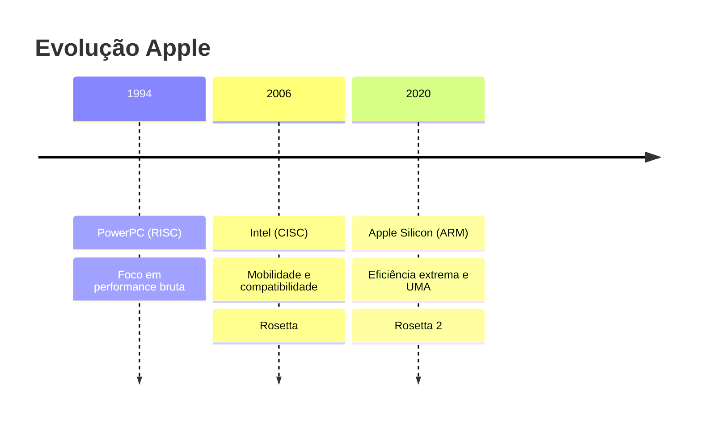

# Aula: O Caso de Estudo Apple 🍎
## Evolução e Eficiência

Entender as transições da Apple é entender a história da eficiência computacional. A distinção entre emulação e simulação define o fluxo de trabalho de um desenvolvedor mobile.

---

## 1. A Jornada do Silício 🕒

A Apple passou por grandes transições de arquitetura, cada uma com um "tradutor" para manter a compatibilidade.

### Linha do Tempo de Transições 📊

!!! concept "Conceito: Arquitetura Unificada de Memória (UMA)"
    No Apple Silicon, a CPU, GPU e NPU compartilham o mesmo pool de memória de alta velocidade. Isso elimina a necessidade de copiar dados entre memórias diferentes, fazendo com que 8GB de RAM rendam muito mais que em sistemas tradicionais.

---

## 2. Ferramentas de Teste: Virtualização vs. Simulação 📱

Como testamos sem o hardware físico?

| Característica | **Emulação (Android)** | **Simulação (iOS)** |
| :--- | :--- | :--- |
| **Definição** | Imita o **Hardware**. | Imita o **Software**. |
| **Arquitetura** | Cria uma CPU virtual (QEMU). | Roda bibliotecas nativas no Mac host. |
| **Performance** | Mais lenta (pesada). | Ultra rápida (leve). |
| **Fidelidade** | Alta (testa limites de RAM). | Média (foco em UI/UX). |

!!! attention "Atenção: Diferença de Comportamento"
    Um app que roda perfeito no **Simulador iOS** pode falhar no aparelho real por questões de temperatura ou memória. Nunca publique sem testar no hardware físico!

---

## 3. Na Prática: Verificando Nativismo 💻

Como saber se um processo está rodando nativamente no seu Mac?

    arch
    arm64
    file /usr/local/bin/legacy_app
    Mach-O 64-bit executable x86_64
    ⚠️ Esse app está rodando via Rosetta 2!

---

## 4. Desenvolver iOS no Windows? 🖥️

A resposta curta é: **Sim, com ressalvas.**

*   **Frameworks Multiplataforma:** Flutter ou React Native permitem escrever o código no Windows.
*   **A "Tranca" da Apple:** Para gerar o arquivo `.ipa` final e publicar, um macOS (físico ou cloud) ainda é obrigatório.
*   **Expo:** Uma ótima ferramenta para testar no iPhone físico sem precisar de Mac durante o desenvolvimento inicial.

!!! tip "Dica: MacinCloud"
    Se você não tem um Mac, serviços como **MacinCloud** permitem alugar um servidor macOS por hora para compilar seus projetos.

---

## 📝 Exercícios Progressivos

1.  **Nível 1:** O que foi a tecnologia **Rosetta** e por que ela foi vital para a Apple em 2006 e 2020?
2.  **Nível 2:** Explique por que o **Simulador do Xcode** é geralmente mais rápido que o **Emulador do Android Studio**.
3.  **Nível 3:** Pesquise sobre a **Arquitetura Unificada de Memória (UMA)** e cite uma vantagem técnica sobre o modelo tradicional de GPU dedicada.

---

## 🚀 Mini-Projeto: Dashboard de Compatibilidade

**Objetivo:** Criar um guia rápido (Tabela MD) para uma equipe que usa diferentes hardwares.

*   **Tarefa 1:** Criar uma tabela listando 3 tecnologias populares (ex: Docker, VS Code, Android Studio).
*   **Tarefa 2:** Indicar se rodam nativamente em `x86`, `ARM (Silicon)` ou via emulação.
*   **Tarefa 3:** Adicionar uma coluna de "Impacto de Performance" (Baixo, Médio, Alto).

---

[Ir para próxima aula: Configuração de Sistemas :octicons-arrow-right-24:](setup-07.md)
