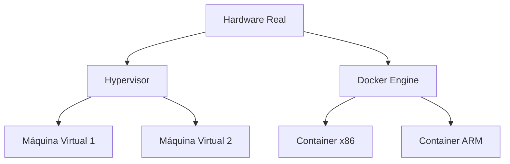

# Aula: Virtualização e Baixo Nível ⚙️
## O "Pulo do Gato" para Desenvolvedores Modernos

Aprenda como rodar código em qualquer lugar e como o software interage com a camada de "quase-hardware".

---

## 1. Virtualização e Abstração 🏗️

Nesta camada, isolamos o hardware para ganhar portabilidade e segurança.

### Camadas de Abstração 📊

*   **Hypervisors:** Proxmox, Hyper-V e VirtualBox.
*   **Containers Multi-Arquitetura:** Uso de **Docker Buildx** para rodar o mesmo app em Intel e ARM.

---

## 2. Firmware e Boot: O Acordar do PC ⚡

*   **BIOS vs. UEFI:** Como o computador entrega o controle ao SO.
*   **Bootloaders:** O papel do **U-Boot** (Mobile/ARM) e do **GRUB**.
*   **Segurança:** TPM e Secure Boot (essenciais para Windows 11 e apps bancários no Mobile).

!!! concept "Conceito: big.LITTLE"
    Processadores móveis misturam núcleos de **Alta Performance** (potência) com núcleos de **Alta Eficiência** (economia). O software deve ser inteligente para não acordar os núcleos potentes sem necessidade.

---

## 3. Na Prática: Docker Multi-Arch 💻

Criando imagens que rodam tanto no seu PC quanto no Raspberry Pi.

    docker buildx create --use
    
    docker buildx build --platform linux/amd64,linux/arm64 -t meu-app .
    🚀 Imagem pronta para Intel e Apple Silicon!

---

## 4. Real-Time Systems (RTOS) ⏱️

Crucial para sistemas críticos como drones ou freios ABS.

!!! attention "Atenção: Determinismo"
    Diferente do Windows, um **RTOS** (como FreeRTOS) garante que uma tarefa será executada em um tempo exato. No desenvolvimento mobile, usamos conceitos similares para garantir a fluidez da UI (60fps).

---

## 5. Comparativo de Ecossistemas 📊

| Tema | Desktop (High) | Mobile (Mid) | Embarcados (Low) |
| :--- | :--- | :--- | :--- |
| **CPU** | Intel i9 / Ryzen 9 | Snapdragon / Apple A | ESP32 / AVR |
| **Arquitetura** | CISC (x86_64) | RISC (ARM64) | RISC (Xtensa) |
| **OS Principal** | Windows / Linux | Android / iOS | RTOS / Bare Metal |

!!! tip "Dica: WebAssembly (Wasm)"
    O Wasm é o "binário universal" que permite rodar código C++/Rust no navegador com performance nativa, independente da CPU por baixo.

---

## 📝 Exercícios Progressivos

1.  **Nível 1:** Explique a diferença entre uma Máquina Virtual e um Container Docker em termos de uso de recursos do hardware.
2.  **Nível 2:** Por que desenvolvedores mobile devem se preocupar com o "Thermal Throttling" (redução de clock por calor)?
3.  **Nível 3:** O que é uma **NPU (Neural Processing Unit)** e como ela ajuda a economizar bateria em tarefas de IA local?

---

## 🚀 Mini-Projeto: Monitor de Recursos Bare-Metal

**Objetivo:** Pesquisar e documentar como acessar o "Uptime" do sistema sem bibliotecas de alto nível.

*   **Tarefa 1:** No Linux, pesquisar o arquivo no `/proc` que guarda a temperatura da CPU.
*   **Tarefa 2:** Criar uma tabela comparando o consumo de RAM de um app "Hello World" em Java vs. Rust.
*   **Tarefa 3:** Simular (teoricamente) o impacto de um loop infinito em um núcleo de "Alta Eficiência" de um ARM.

---

[Ir para próxima aula: Mobile (Flutter e Kotlin) :octicons-arrow-right-24:](setup-08.md)
