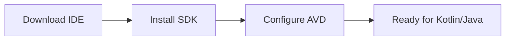

# Aula: Mobile (Flutter e Kotlin) 📱
## Ambiente de Desenvolvimento Pro

O desenvolvimento mobile exige ferramentas mais pesadas. Prepare sua máquina para criar apps profissionais.

---

## 1. Android Studio: O Motor Nativo 🛠️

Essencial para emular celulares Android e realizar debug de baixo nível.

### Fluxo de Instalação 📊

1.  Baixe em [developer.android.com/studio](https://developer.android.com/studio).
2.  Instale e deixe ele baixar o **Android SDK**.

!!! attention "Atenção: Aceleração de Hardware"
    Para rodar o emulador rápido, ative o **Intel HAXM** ou **Hyper-V** na sua BIOS. Sem isso, o emulador será extremamente lento.

---

## 2. Flutter SDK: Multiplataforma 🚀

Para criar apps iOS e Android com a mesma base de código.

1.  Extraia o SDK em `C:\src\flutter`.
2.  Adicione o `bin` ao **Path** do Windows.

### Verificando a Saúde do Ambiente 💻

    flutter doctor
    
    flutter doctor --android-licenses
    [✓] Android toolchain - developed for Android devices
    [✓] Chrome - developed for the web
    🚀 Siga as instruções do doctor para finalizar!

---

## 3. Visual Studio Code 💻

O editor preferido por ser leve e ter extensões poderosas.

!!! tip "Dica: Extensões Obrigatórias"
    Instale as extensões **Flutter** e **Dart**. Elas trazem autocomplete, refactoring e hot reload automático.

---

## 📝 Exercícios Progressivos

1.  **Nível 1:** Qual a função do comando `flutter doctor` e por que ele é a primeira coisa a se rodar após instalar o SDK?
2.  **Nível 2:** Por que precisamos do Android Studio mesmo se formos programar apenas em Flutter usando o VS Code?
3.  **Nível 3:** Explique a diferença entre um **AVD (Android Virtual Device)** e um dispositivo físico para testes.

---

## 🚀 Mini-Projeto: First Run

**Objetivo:** Criar e rodar o projeto padrão do Flutter.

*   **Tarefa 1:** Criar o projeto via terminal: `flutter create meu_primeiro_app`.
*   **Tarefa 2:** Abrir o projeto no VS Code e localizar o arquivo `main.dart`.
*   **Tarefa 3:** Rodar o app no emulador e testar o **Hot Reload** mudando a cor do tema.

---

[Ir para próxima aula: Ecossistemas Modernos :octicons-arrow-right-24:](setup-09.md)