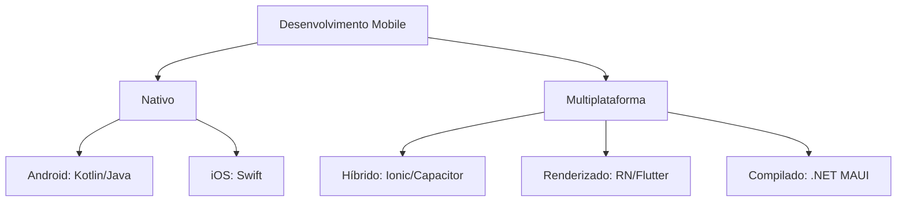

# Aula: Ecossistemas Mobile Modernos 📱
## Pontes entre Hardware e Software

Nesta aula, exploraremos como transformamos código em apps funcionais para **Android (ARM)** e **iOS (Apple Silicon)**, navegando entre soluções nativas e multiplataforma.

---

## 1. O Espectro do Desenvolvimento 🏗️

O desenvolvedor moderno deve escolher entre **Performance Máxima** (Nativo) ou **Agilidade de Escopo** (Multiplataforma).

### Mapeamento de Tecnologias 📊

*   **Nativo:** Acesso total ao hardware com latência zero.
*   **Multiplataforma:** Reuso de código (escreva uma vez, rode em dois).

---

## 2. Na Prática: O Poder da CLI 💻

Para criar um app moderno, o fluxo via terminal é o padrão de mercado.

    npx ionic start MySuperApp tabs --type=angular
    
    npx cap add android
    🚀 Projeto configurado para ARM64/x86!

---

## 3. Blocos de Conhecimento 🧠

!!! concept "Conceito: Compilação AOT vs JIT"
    No iOS, o código **deve** ser compilado **AOT** (*Ahead-of-Time*) por segurança. No Android, usamos **JIT** (*Just-in-Time*) para otimizar o app enquanto ele roda.

!!! attention "Atenção: Bridge vs Engine"
    O **React Native** usa uma "ponte" (bridge) para falar com o nativo, o que pode causar gargalos. O **Flutter** carrega sua própria "engine" de desenho (Skia/Impeller), sendo mais fluido na UI.

!!! tip "Dica: .NET MAUI"
    O MAUI é a evolução do Xamarin e permite criar apps para Android, iOS e Windows ARM usando C#. É ideal para ecossistemas corporativos.

---

## 📝 Exercícios Progressivos

1.  **Nível 1:** Explique por que um app feito em Ionic tende a consumir mais memória RAM do que um app em Swift nativo.
2.  **Nível 2:** Em qual camada do sistema operacional o .NET MAUI atua para acessar o GPS de diferentes plataformas simultaneamente?
3.  **Nível 3:** Desenhe (mentalmente ou em papel) o fluxo de dados de um botão clicado em um app React Native até ele ser processado pela CPU ARM.

---

## 🚀 Mini-Projeto: Dashboard de Arquitetura

**Objetivo:** Criar um protótipo que detecta a arquitetura do processador.

*   **Requisito 1:** Usar **Ionic + Capacitor** para acessar a API de `Device Info`.
*   **Requisito 2:** Exibir se o dispositivo é `arm64`, `x86_64` ou `unknown`.
*   **Requisito 3:** Adicionar um botão que simula um processamento pesado para observar o comportamento térmico.

---

[Retornar ao Índice de Setups :octicons-arrow-left-24:](index.md)
