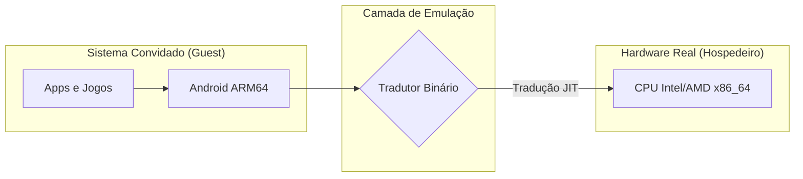

# 🎮 Aula: A Arte da Simulação - Emulação Android vs. Videogames

Entender a emulação é entender a tradução em tempo real. Se o Android fala "Português" (Instruções ARM) e seu PC fala "Inglês" (Instruções x86), precisamos de um tradutor muito rápido no meio do caminho.

---

## 1. O Tradutor de Instruções (ISA)

Imagine que você quer rodar um jogo de **Super Nintendo (65816)** no seu **PC (x86)**. O emulador precisa ler cada instrução do jogo e converter para algo que o seu processador entenda. No Android é igual.

* **Emulação por Software:** O PC lê a instrução ARM, interpreta o que ela faz e executa uma função equivalente em x86. É lento (como o emulador de PS3 no PC).
* **Virtualização (HAXM/KVM):** Se o Android que você está emulando for versão x86, o PC não traduz, ele apenas "isola" uma fatia do processador. É muito rápido.

---

## 2. Por que o Emulador de Android é "Pesado"?

Diferente de um emulador de GameBoy, o Android é um sistema operacional completo (Kernel Linux, Interface Gráfica, Drivers).

* **GPU Passthrough:** O emulador precisa traduzir comandos **OpenGL/Vulkan** do Android para a sua placa de vídeo real.
* **Aceleração de Hardware:** Sem o Intel VT-x ou AMD-V ativado na BIOS, o emulador tenta traduzir tudo via software, resultando em 1 FPS.

---

## 3. Na Prática: Verificando Suporte e Iniciando

Antes de rodar um "console" Android no seu PC, precisamos garantir que os motores de tradução estão ativos.

cpu-check --is-virtualization-enabled
KVM acceleration can be used: YES
emulator -avd Pixel_7_Pro_API_34 -gpu host

🚀 Android booting on x86_64 using Hardware Acceleration...

---

## 🧠 Blocos de Conhecimento

> **💡 Conceito: Tradução Binária Dinâmica**
> É o processo onde o emulador traduz blocos de código ARM para x86 "on-the-fly". É exatamente o que o **Rosetta 2** faz nos Macs M1/M2, mas no sentido inverso (x86 para ARM).

> **⚠️ Atenção: Intel Atom vs. ARM**
> Antigamente, existiam celulares com processador Intel Atom (x86). Neles, não havia emulação, o Android rodava nativo. Hoje, 99% dos celulares são ARM, exigindo tradução pesada nos emuladores.

---

## 📝 Exercícios Progressivos

1. **Analítico:** Por que emular um PlayStation 1 (33MHz) é muito mais fácil do que emular um celular Android moderno de entrada?
2. **Arquitetura:** Explique a diferença entre usar uma imagem de sistema `arm64-v8a` vs `x86_64` no Android Studio. Qual terá melhor performance no seu PC?
3. **Hardware:** Pesquise por que o recurso **VT-x (Intel)** ou **SVM (AMD)** precisa estar habilitado na BIOS para o emulador funcionar bem.

---

## 🚀 Mini-Projeto: "The Emulator Benchmarker"

**Objetivo:** Comparar a velocidade de execução de um algoritmo de cálculo entre o seu PC nativo e o Android emulado.

1. Crie um script simples que calcula números primos até 100.000.
2. Execute-o no seu terminal (PowerShell/Bash).
3. Execute-o dentro do emulador Android (via `adb shell`).
4. **Relatório:** Calcule o "Custo da Emulação" (Tempo Android / Tempo PC). Se o Android demorar 2x mais, seu custo de tradução é de 100%.