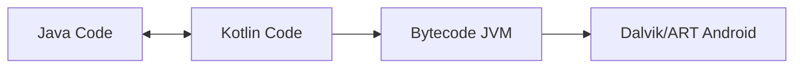

# Aula 03 - Kotlin Moderno ⚡

<!-- .slide: data-transition="convex" -->

---

## 🚀 O que é Kotlin?

A linguagem que mudou o Android.

* Criada pela JetBrains (2011). <!-- .element: class="fragment" -->
* Oficial no Android (Google I/O 2017). <!-- .element: class="fragment" -->
* **Moderna**, **Segura** e **Concisa**. <!-- .element: class="fragment" -->

---

## 🛡️ Null Safety: O Fim dos Crashes

O pesadelo do Java era o `null`.
O Kotlin resolveu isso na raiz.

```kotlin
var nome: String = "Ricardo"
nome = null // Erro de Compilação! 🛑
```

Para permitir nulos:
```kotlin
var nome: String? = "Pode ser nulo"
nome = null // OK! ✅
```

---

## 📦 Variáveis: `val` vs `var`

No Kotlin, preferimos a imutabilidade.

* **val**: Imutável (referência não muda). 🔒 <!-- .element: class="fragment" -->
* **var**: Mutável (pode mudar o valor). 🔓 <!-- .element: class="fragment" -->

```kotlin
val idade = 25 // Nunca mais muda
var saldo = 100.0 // Pode mudar
```

---

## ⚡ Inferência de Tipos

O Kotlin é inteligente. Ele sabe o tipo sem você dizer.

```kotlin
val versao = 15 // Ele sabe que é Int
val pi = 3.14 // Ele sabe que é Double
```

---

## 💬 Interpolação de Strings

Diga adeus ao `+ " " +`.

```kotlin
val usuario = "Google"
println("Olá, $usuario! Temos ${10 + 2} notificações.")
```

---

## 🕴️ Operador Elvis `?:`

"Se for nulo, faça isso".

```kotlin
val nome: String? = null
val resultado = nome ?: "Visitante"
// resultado = "Visitante"
```

---

## 🛠️ Funções: Simplicidade

```kotlin
fun somar(a: Int, b: Int): Int {
    return a + b
}

// Versão "Single Line"
fun somar(a: Int, b: Int) = a + b
```

---

## 🏗️ Estruturas de Decisão

O `if` e o `when` no Kotlin são **expressões** (retornam valor).

```kotlin
val status = if (nota >= 6) "Aprovado" else "Reprovado"

when (nota) {
    10 -> println("Genial!")
    in 7..9 -> println("Muito bom")
    else -> println("Tente mais")
}
```

---

## 📋 Coleções

Listas que facilitam a vida.

```kotlin
val numeros = listOf(1, 2, 3) // Imutável
val nomes = mutableListOf("Ana", "Bia") // Mutável
nomes.add("Caio")
```

---

## 🏛️ Classes e Objetos

Mais limpo que o Java.

```kotlin
class Carro(val model: String, var ano: Int)

val meuCarro = Carro("Fusca", 1970)
println(meuCarro.model)
```

---

### 📊 Data Classes

Onde o Kotlin brilha de verdade.

```kotlin
data class Usuario(val id: Int, val email: String)
// Gera automaticamente: toString, equals, hashCode, copy...
```

---

## 🧬 Interoperabilidade

Você pode misturar Java e Kotlin no mesmo projeto sem problemas.



---

## 🍎 Comparação: Swift

O Kotlin e o Swift são quase "gêmeos" na sintaxe moderna.

| Recurso | Kotlin | Swift |
| :--- | :--- | :--- |
| **Constante** | `val` | `let` |
| **Variável** | `var` | `var` |
| **Opcional** | `String?` | `String?` |
| **Função** | `fun` | `func` |

---

## 🎮 Playground da Aula

Acesse [play.kotlinlang.org](https://play.kotlinlang.org) e teste:

1. Crie uma variável que pode ser nula. <!-- .element: class="fragment" -->
2. Use o operador Elvis nela. <!-- .element: class="fragment" -->
3. Crie uma data class "Produto". <!-- .element: class="fragment" -->

<!-- .slide: data-background-color="#3d5a80" -->

---

## ⚠️ Safe Call `?.`

Chama o método apenas se não for nulo.

```kotlin
val nome: String? = null
println(nome?.length) // Não crasha! Imprime "null"
```

---

## 🏁 Conclusão

* Kotlin economiza tempo e dedos (menos código). <!-- .element: class="fragment" -->
* Segurança contra nulos é o seu maior trunfo. <!-- .element: class="fragment" -->
* É a linguagem do futuro do Android. <!-- .element: class="fragment" -->

---

## 🚀 Próxima Aula: Anatomia de um App

Vamos abrir o Android Studio e ver como o Kotlin controla as telas!

---

### Até a próxima! ⚡👋
