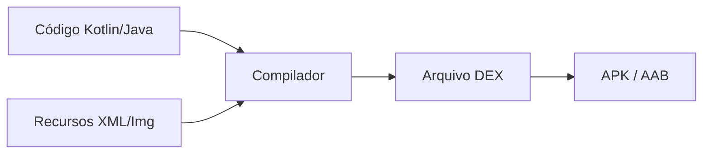

# Aula 04 - Estrutura de um App 🏗️

<!-- .slide: data-transition="zoom" -->

---

## 🧐 O que tem "debaixo do capô"?

Ao abrir um projeto no Android Studio, vemos muitas pastas.
Não se desespere! Vamos entender cada uma.

---

## 📂 Visão Geral do Projeto

Existem dois modos de visão: **Project** e **Android**.
Nós usaremos o modo **Android** (mais organizado).

---

## 1. O Manifesto 📜

`app/src/main/AndroidManifest.xml`

É o contrato do seu app com o sistema operacional.

* Nome e Ícone do App. <!-- .element: class="fragment" -->
* Declaração de todas as **Activities**. <!-- .element: class="fragment" -->
* Solicitação de **Permissões** (Câmera, GPS). <!-- .element: class="fragment" -->

---

## 2. A Pasta `java` (ou `kotlin`) ⌨️

Onde a "mágica" acontece.

* Ficam as classes de lógica. <!-- .element: class="fragment" -->
* Ficam as classes das telas (MainActivity). <!-- .element: class="fragment" -->
* Organizado em **pacotes** (ex: `com.meuapp.telas`). <!-- .element: class="fragment" -->

---

## 3. A Pasta `res` (Resources) 🎨

Tudo o que o usuário **vê** ou **ouve**, mas que não é lógica.

* **drawable**: Imagens e ícones. <!-- .element: class="fragment" -->
* **layout**: A interface visual (XML). <!-- .element: class="fragment" -->
* **mipmap**: Ícones que aparecem no menu do celular. <!-- .element: class="fragment" -->
* **values**: Strings, Cores e Temas. <!-- .element: class="fragment" -->

---

### 🎨 Por que centralizar os `values`?

Evite escrever texto direto no código!

```xml
<!-- res/values/strings.xml -->
<string name="boas_vinda">Bem-vindo ao App!</string>
```

> Facilita a tradução para outros idiomas (Internacionalização). 🌍

---

## 4. Gradle: O Gerente de Fábrica ⚙️

Não é código do seu app, é a configuração da "fábrica" que constrói ele.

* `build.gradle (Project)`: Configurações globais. <!-- .element: class="fragment" -->
* `build.gradle (Module)`: Configurações específicas do App. <!-- .element: class="fragment" -->

---

### 📦 O que tem no Gradle?

* **versionCode**: Número interno (1, 2, 3...). <!-- .element: class="fragment" -->
* **versionName**: Nome para o usuário (1.0.1...). <!-- .element: class="fragment" -->
* **Dependencies**: Bibliotecas externas (Retrofit, Room). <!-- .element: class="fragment" -->

---

## 🏗️ O Ciclo de Build



---

## 🆚 Estrutura: Android vs iOS

| Android | iOS | Papel |
| :---: | :---: | :--- |
| `AndroidManifest` | `Info.plist` | Metadados |
| `res/layout` | `Storyboard/XIB` | UI Visual |
| `gradle` | `CocoaPods/SwiftPM` | Dependências |
| `res/values` | `Localizable.strings` | Textos |

---

## 🔌 ViewBinding: O Link Seguro

Antigamente usava-se o `findViewById` (lento e perigoso).
Hoje usamos o **ViewBinding**.

```kotlin
// No código Kotlin
binding.txtTitulo.text = "Novo Título"
```

> Garante que você não tente acessar um ID que não existe na tela! 🛡️

---

## 🛠️ Prática: Explorando o Studio

1. Abra o arquivo `Activity_main.xml`. <!-- .element: class="fragment" -->
2. Veja as abas **Code**, **Split** e **Design**. <!-- .element: class="fragment" -->
3. Mantenha no **Split** para aprender rápido! <!-- .element: class="fragment" -->

<!-- .slide: data-background-color="#2d6a4f" -->

---

## ⚠️ Cuidado com a pasta `build`

Ela é gerada automaticamente.
**Nunca** altere nada dentro dela manualmente. Se der erro, use o comando:
`Build -> Clean Project`.

---

## 🧩 Resumo

* **Manifesto**: Declarativo e essencial. <!-- .element: class="fragment" -->
* **Res**: Visual e Multimídia. <!-- .element: class="fragment" -->
* **Gradle**: Configuração e Bibliotecas. <!-- .element: class="fragment" -->
* **Java/Kotlin**: Comportamento. <!-- .element: class="fragment" -->

---

## 🚀 Desafio da Aula

1. Adicione uma nova cor em `colors.xml`. <!-- .element: class="fragment" -->
2. Crie uma nova String em `strings.xml`. <!-- .element: class="fragment" -->
3. Use essa cor e essa string em um componente na tela inicial. <!-- .element: class="fragment" -->

---

## 🏁 Conclusão

Entender a estrutura é o primeiro passo para não se perder em projetos grandes.

---

### Próxima Aula: Interface Gráfica (Layouts)! 🎨👋
