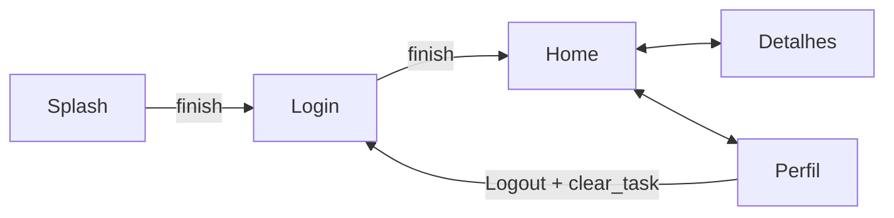

# Aula 06 - Navegação entre Telas 🗺️

<!-- .slide: data-transition="slide" -->

---

## 📨 O que é uma Intent?

Seu App é um conjunto de telas. As `Intents` são as mensagens que conectam essas telas.

* "Quero abrir a tela X". <!-- .element: class="fragment" -->
* "Quero passar este dado para a tela Y". <!-- .element: class="fragment" -->
* "Quero que outro app resolva este link". <!-- .element: class="fragment" -->

---

## 🚀 Intent Explícita

Você sabe exatamente para onde quer ir.

```kotlin
val intent = Intent(this, SecondActivity::class.java)
startActivity(intent)
```

> Usado para navegação interna do seu aplicativo.

---

## 🌍 Intent Implícita

Você diz **O QUE** quer fazer, não **QUEM** deve fazer.

```kotlin
val intent = Intent(Intent.ACTION_VIEW, Uri.parse("https://google.com"))
startActivity(intent)
```

* O sistema Android pergunta ao usuário qual navegador ele prefere usar. <!-- .element: class="fragment" -->

---

### Exemplos Implícitos

* **ACTION_DIAL**: Abrir o discador. <!-- .element: class="fragment" -->
* **ACTION_SEND**: Compartilhar algo. <!-- .element: class="fragment" -->
* **ACTION_IMAGE_CAPTURE**: Abrir a câmera. <!-- .element: class="fragment" -->

---

## 📦 Passando Dados (Extras)

O "pacote" que viaja com a Intent.

```kotlin
// Tela A (Enviando)
intent.putExtra("NOME", "Android")
intent.putExtra("IDADE", 15)

// Tela B (Recebendo)
val nome = intent.getStringExtra("NOME")
val idade = intent.getIntExtra("IDADE", 0)
```

---

## 📚 A Pilha de Voltar (Back Stack)

O Android gerencia telas como uma pilha de pratos.

1. `startActivity` coloca um prato no topo. <!-- .element: class="fragment" -->
2. Botão "Back" (Voltar) tira o prato do topo. <!-- .element: class="fragment" -->
3. O prato que estava embaixo volta a ser visível. <!-- .element: class="fragment" -->

---

### O Comando `finish()` 🧹

Encerra a Activity atual e a remove da pilha.

```kotlin
startActivity(Intent(this, HomeActivity::class.java))
finish() // O usuário não consegue voltar para a tela anterior
```

> Ideal para fluxos de Login e Splash Screens.

---

## 🆚 Navegação: Android vs iOS

| Conceito | Android | iOS |
| :---: | :---: | :--- |
| **Componente** | Activity | ViewController |
| **Pilha** | Back Stack | Navigation Controller |
| **Ação** | Intent | Segue / Push |
| **Dados** | Extras | Properties / PrepareForSegue |

---

## 🎨 Transições entre Telas

Dê vida ao seu app!

```kotlin
startActivity(intent)
overridePendingTransition(R.anim.slide_in_right, R.anim.slide_out_left)
```

---

## 🧭 Navigation Component (Jetpack)

A forma moderna e visual.

* **Navigation Graph**: Mapa visual das telas. <!-- .element: class="fragment" -->
* **Fragments**: Telas "leves" dentro de uma única Activity. <!-- .element: class="fragment" -->
* **Safe Args**: Passagem de dados sem erros de digitação. <!-- .element: class="fragment" -->

<!-- .slide: data-background-color="#51344d" -->

---

## 🛠️ Prática: Indo para os Detalhes

1. Crie uma nova Activity chamada `DetalhesActivity`. <!-- .element: class="fragment" -->
2. No `MainActivity`, adicione um botão. <!-- .element: class="fragment" -->
3. No clique do botão, peça para abrir os Detalhes. <!-- .element: class="fragment" -->

---

### Código da Prática

```kotlin
binding.btnIr.setOnClickListener {
    val intent = Intent(this, DetalhesActivity::class.java)
    intent.putExtra("INFO", "Vindo da Main!")
    startActivity(intent)
}
```

---

## ⚠️ Cuidado com a Memória

Abrir muitas Activities sem dar `finish()` pode deixar o app pesado e confuso.

> Pergunte-se: "O usuário deve conseguir voltar para esta tela?"

---

## 🧬 Mermaid: Fluxo de Navegação



---

## 🚀 Desafio da Aula: O Mensageiro

1. Crie uma tela com um `EditText` e um `Button`. <!-- .element: class="fragment" -->
2. Ao clicar, abra uma segunda tela exibindo o texto que foi digitado. <!-- .element: class="fragment" -->
3. Na segunda tela, coloque um botão "Voltar" customizado que dá um `finish()`. <!-- .element: class="fragment" -->

---

## 🏁 Resumo

* **Intents**: Mensageiros universais. <!-- .element: class="fragment" -->
* **Extras**: O conteúdo da mensagem. <!-- .element: class="fragment" -->
* **Back Stack**: A memória de onde viemos. <!-- .element: class="fragment" -->

---

## ❓ Perguntas?

---

### Próxima Aula: Listas Dinâmicas (RecyclerView)! 📋👋
