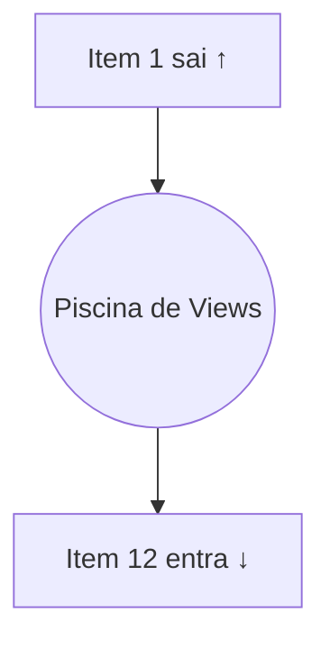

# Aula 09 - Listas Eficientes (RecyclerView) 📋

<!-- .slide: data-transition="zoom" -->

---

## 🐢 O Problema das Listas Gigantes

Imagine uma lista com 10.000 contatos.
Criar 10.000 objetos de layout travaria qualquer celular.

* Memória cheia. <!-- .element: class="fragment" -->
* Lag na rolagem. <!-- .element: class="fragment" -->
* App fechando (Crash). <!-- .element: class="fragment" -->

---

## ♻️ A Mágica da Reciclagem

O **RecyclerView** não cria 10.000 itens.
Ele cria apenas o que cabe na tela (+ uns 2 ou 3 de reserva).

* Item sai por cima -> Entra na "piscina". <!-- .element: class="fragment" -->
* Item entra por baixo -> Pega um layout da piscina e só troca o texto. <!-- .element: class="fragment" -->

---

### O Mecanismo visual



---

## ⚔️ Os 3 Pilares

Para fazer um RecyclerView, você precisa de:

1. **LayoutManager**: Define o formato (Lista, Grade, etc). <!-- .element: class="fragment" -->
2. **ViewHolder**: Guarda as referências dos IDs (Gaveta). <!-- .element: class="fragment" -->
3. **Adapter**: Liga os dados às Views (O Cérebro). <!-- .element: class="fragment" -->

---

## 📐 1. LayoutManager

Troque a cara da sua lista com 1 linha:

* **LinearLayoutManager**: Lista vertical/horizontal. <!-- .element: class="fragment" -->
* **GridLayoutManager**: Grade (estilo galeria). <!-- .element: class="fragment" -->
* **StaggeredGridLayoutManager**: Grade tipo Pinterest. <!-- .element: class="fragment" -->

---

## 🗄️ 2. ViewHolder

Evita que o Android tenha que procurar o `findViewById` milhares de vezes.

```kotlin
class MeuViewHolder(view: View) : RecyclerView.ViewHolder(view) {
    val nome = view.findViewById<TextView>(R.id.txtNome)
}
```

---

## 🧠 3. Adapter

Onde a lógica acontece.

* `onCreateViewHolder`: Infla o layout do XML. <!-- .element: class="fragment" -->
* `onBindViewHolder`: Coloca os dados na tela. <!-- .element: class="fragment" -->
* `getItemCount`: Diz quantos itens a lista tem. <!-- .element: class="fragment" -->

---

## 👆 Lidando com Cliques

O RecyclerView não tem clique nativo. Nós criamos!

```kotlin
holder.itemView.setOnClickListener {
    val item = lista[position]
    // Abrir detalhes...
}
```

---

## 🆚 Android vs iOS

O mecanismo é IGUAL. Só mudam os nomes.

| Conceito | Android | iOS |
| :--- | :--- | :--- |
| **Componente** | RecyclerView | UITableView |
| **Reciclagem** | Scrap Heap | Reusable Cell |
| **Dados** | Adapter | Data Source |
| **Gaveta** | ViewHolder | UITableViewCell |

---

## 🚀 Otimização: ListAdapter & DiffUtil

`notifyDataSetChanged()` é coisa do passado.

* O **DiffUtil** calcula o que mudou. <!-- .element: class="fragment" -->
* Animações automáticas de inserção e remoção. <!-- .element: class="fragment" -->
* Muito mais rápido para o processador. <!-- .element: class="fragment" -->

<!-- .slide: data-background-color="#5a189a" -->

---

## 🛠️ Prática: Lista de Compras

1. Crie um layout `item_produto.xml`. <!-- .element: class="fragment" -->
2. Crie a lista de objetos `Produto`. <!-- .element: class="fragment" -->
3. Implemente o Adapter e veja a mágica da rolagem fluida. <!-- .element: class="fragment" -->

---

### Dica: CardView 🃏

Use `MaterialCardView` nos seus itens para ganhar sombras e bordas arredondadas automaticamente!

```xml
<com.google.android.material.card.MaterialCardView ...>
    <!-- Seus textos/imagens aqui -->
</com.google.android.material.card.MaterialCardView>
```

---

## ⚠️ Erro Comum

Tentar atualizar a lista e esquecer de avisar o Adapter.
Sempre que o dado do banco/internet chegar, use:
`adapter.submitList(novaLista)` (se usar ListAdapter).

---

## 🏁 Conclusão

* RecyclerView é obrigatório em 99% dos apps. <!-- .element: class="fragment" -->
* O foco é performance e economia de memória. <!-- .element: class="fragment" -->
* Masterize o Adapter e você dominará o Android. <!-- .element: class="fragment" -->

---

## ❓ Perguntas sobre Listas?

---

### Próxima Aula: Consumo de APIs com Retrofit! 🌍👋
