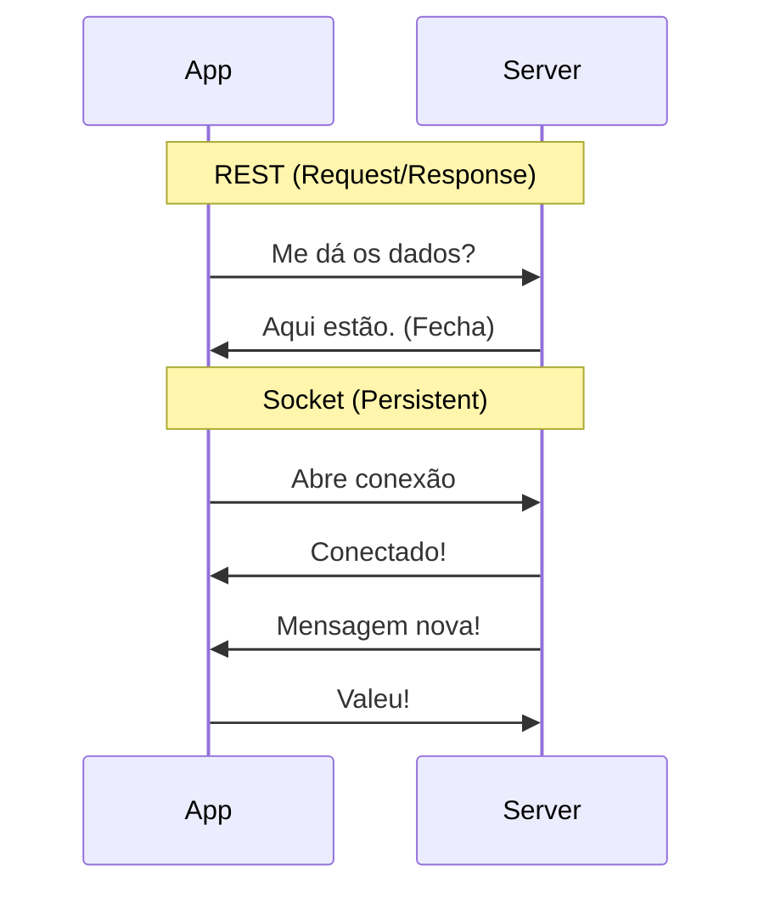

# Aula 11 - Threads e Coroutines 🧵

<!-- .slide: data-transition="convex" -->

---

## 🛑 O Bloqueio da UI

O Android é um sistema exigente: ele redesenha a tela a cada 16ms (60fps).

* **Main Thread**: Onde tudo o que é visual acontece. <!-- .element: class="fragment" -->
* **Regra de Ouro**: Nunca coloque código pesado na Main Thread. <!-- .element: class="fragment" -->

---

### O Erro ANR 💀

Se a Main Thread parar por +5 segundos...
**Application Not Responding**. O sistema mata seu app.

* Download de arquivos. <!-- .element: class="fragment" -->
* Leitura de banco de dados pesada. <!-- .element: class="fragment" -->
* Processamento de imagens. <!-- .element: class="fragment" -->

---

## ⚡ Kotlin Coroutines

"Threads leves".

* Você pode rodar milhões sem travar o celular. <!-- .element: class="fragment" -->
* Código assíncrono que parece sequencial. <!-- .element: class="fragment" -->
* Criado pela JetBrains para facilitar sua vida. <!-- .element: class="fragment" -->

---

## 🏛️ Os 3 Pilares da Coroutine

1. **Job**: A tarefa em si (o trabalho). <!-- .element: class="fragment" -->
2. **Scope**: Onde ela vive (morreu a tela, morre a tarefa). <!-- .element: class="fragment" -->
3. **Dispatcher**: Em qual pista ela corre (Threads). <!-- .element: class="fragment" -->

---

### 🚦 Conheça os Dispatchers

* **Main**: Só para interface (UI). <!-- .element: class="fragment" -->
* **IO**: Rede, Banco, Arquivos (Espera). <!-- .element: class="fragment" -->
* **Default**: Cálculos pesados de CPU. <!-- .element: class="fragment" -->

---

## 🛌 A palavra-chave `suspend`

"Esta função pode demorar, mas não vai travar o celular".

```kotlin
suspend fun buscarDados() {
    delay(2000) // Pausa a coroutine, não a thread!
    println("Terminei")
}
```

---

## 🧠 Coroutines na ViewModel

```kotlin
class MeuViewModel : ViewModel() {
    fun carregar() {
        viewModelScope.launch { // Inicia no Scope seguro
             val dados = withContext(Dispatchers.IO) {
                 api.getDados() // Roda em background
             }
             binding.txt.text = dados // Volta pra Main e atualiza
        }
    }
}
```

<!-- .slide: data-background-color="#3d5a80" -->

---

## 🔌 Sockets (Tempo Real)

REST é: "Eu peço, você responde".
Socket é: "Canal aberto, qualquer um fala".

* **Full-Duplex**: Envio e Recebimento simultâneo. <!-- .element: class="fragment" -->
* **Casos**: Chat, GPS em tempo real, Bolsa de Valores. <!-- .element: class="fragment" -->

---

### Socket vs REST



---

## 🆚 Android vs iOS (Async)

| Recurso | Android (Kotlin) | iOS (Swift) |
| :--- | :--- | :--- |
| **Padrão** | Coroutines | Async / Await |
| **Palavra** | `suspend` | `async` |
| **Chamada** | `launch` | `Task` |
| **Espera** | `delay` | `try await Task.sleep` |

---

## 🚫 Cancelamento Automático

O `viewModelScope` é fantástico.

1. Usuário abre a tela e começa o download. <!-- .element: class="fragment" -->
2. Usuário fecha o app ou muda de tela. <!-- .element: class="fragment" -->
3. O download é cancelado na hora. Economia de bateria e dados! <!-- .element: class="fragment" -->

---

## 🛠️ Prática: O Simulador de Corrida

```kotlin
suspend fun corrida() {
    println("3...")
    delay(1000)
    println("2...")
    delay(1000)
    println("1...")
    delay(1000)
    println("JÁ!")
}
```

* Chame isso num clique de botão e tente clicar em outro botão enquanto a contagem ocorre. Se funcionar, você venceu o ANR! 🏆

---

## 🏁 Conclusão

* Main Thread é sagrada. <!-- .element: class="fragment" -->
* Coroutines trazem ordem ao caos assíncrono. <!-- .element: class="fragment" -->
* Sempre use `viewModelScope` para segurança. <!-- .element: class="fragment" -->

---

## ❓ Perguntas sobre Threads?

---

### Próxima Aula: UX e Material Design 3! 🎨👋
