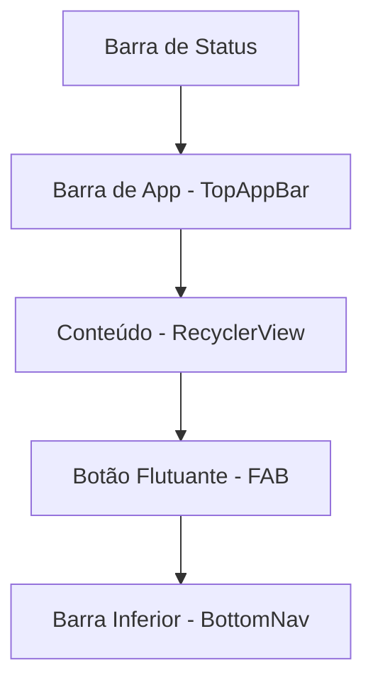

# Aula 12 - UX e Material Design 3 🎨

<!-- .slide: data-transition="zoom" -->

---

## 💄 O que é Material Design?

O sistema de design do Google.

* Criado em 2014. <!-- .element: class="fragment" -->
* Inspirado em papel e tinta. <!-- .element: class="fragment" -->
* Agora na versão 3: **Material You**. <!-- .element: class="fragment" -->

---

## 🌸 Material You (M3)

A personalização elevada ao máximo.

* **Cores Dinâmicas**: O app suga as cores do papel de parede do usuário. <!-- .element: class="fragment" -->
* **Acessibilidade**: Foco em contraste e tamanhos de toque. <!-- .element: class="fragment" -->
* **Expressividade**: Formas orgânicas e arredondadas. <!-- .element: class="fragment" -->

---

## 📐 O Grid de 8dp

No Android, medimos tudo em múltiplos de 8.

* 8, 16, 24, 32, 40... <!-- .element: class="fragment" -->
* Isso garante alinhamento harmônico em qualquer tela. <!-- .element: class="fragment" -->
* Regras de margem e padding seguem esse padrão. <!-- .element: class="fragment" -->

---

## 🔘 Componentes Modernos

---

### 1. FAB (Floating Action Button)

O botão que "flutua" sobre o conteúdo.

* Representa a ação principal. <!-- .element: class="fragment" -->
* Ex: Criar novo e-mail, Adicionar tarefa. <!-- .element: class="fragment" -->

---

### 2. Cards 🃏

Agrupam informações relacionadas.

* Elevação (sombras). <!-- .element: class="fragment" -->
* Bordas arredondadas (12dp a 28dp). <!-- .element: class="fragment" -->

---

### 3. Bottom Navigation 🧭

Navegação principal ao alcance do polegar.

* Entre 3 e 5 destinos. <!-- .element: class="fragment" -->
* Ideal para uso com uma mão só. <!-- .element: class="fragment" -->

---

## 🌑 Dark Mode: Não é opcional!

O usuário ama o tema escuro.

* Economia de bateria (telas OLED). <!-- .element: class="fragment" -->
* Descanso visual à noite. <!-- .element: class="fragment" -->
* **Como fazer**: Pasta `values-night/colors.xml`. <!-- .element: class="fragment" -->

<!-- .slide: data-background-color="#121212" -->

---

## 🆚 Material (Android) vs HIG (iOS)

| Característica | Android (Material) | iOS (HIG) |
| :--- | :--- | :--- |
| **Foco** | Elevação / Camadas | Transparência / Blur |
| **Botões** | FAB / Sombreados | Flat / Bordas finas |
| **Navegação** | Drawer / Bottom Nav | Tab Bar Superior/Inferior |
| **Espírito** | Papel e Tinta | Vidro e Minimalismo |

---

## 🔡 Tipografia: Roboto e Além

A fonte oficial do Android.

* Use pesos variados para criar hierarquia. <!-- .element: class="fragment" -->
* Título: Bold / Grande. <!-- .element: class="fragment" -->
* Corpo: Regular / 14sp ou 16sp. <!-- .element: class="fragment" -->

---

## 🌊 Feedback Visual (Ripples)

"O app está me ouvindo?"

* Sempre que o usuário tocar, algo deve acontecer. <!-- .element: class="fragment" -->
* Efeito **Ripple** (Onda) é o padrão. <!-- .element: class="fragment" -->

---

## 🛠️ Prática: Estilizando com M3

1. No `build.gradle`, use Material 1.9.0+. <!-- .element: class="fragment" -->
2. No XML, troque `Button` por `MaterialButton`. <!-- .element: class="fragment" -->
3. Teste o atributo `app:cornerRadius` e veja a mudança. <!-- .element: class="fragment" -->

---

## 🧬 Mermaid: Camadas UI

---

## 🧠 UX: Experiência do Usuário

UX não é só "bonito", é "funcional".

* **Velocidade**: Carregamento rápido. <!-- .element: class="fragment" -->
* **Clareza**: Icons autoexplicativos. <!-- .element: class="fragment" -->
* **Prevenção**: Não deixe o usuário errar (validações). <!-- .element: class="fragment" -->

---

## 🏁 Conclusão

* Design ruim mata apps bons. <!-- .element: class="fragment" -->
* Siga o grid de 8dp. <!-- .element: class="fragment" -->
* Pense sempre na acessibilidade (Content Description!). <!-- .element: class="fragment" -->

---

## ❓ Perguntas sobre Visual?

---

### Próxima Aula: Sensores e Hardware! 📸👋
