# Aula 13 - Sensores e Hardware 📸

<!-- .slide: data-transition="zoom" -->

---

## 📱 Além da Tela

O smartphone é um laboratório de sensores.
Apps nativos têm "superpoderes" para sentir o mundo físico.

* Onde eu estou? (GPS) <!-- .element: class="fragment" -->
* O que eu estou vendo? (Câmera) <!-- .element: class="fragment" -->
* Estou me movendo? (Acelerômetro) <!-- .element: class="fragment" -->

---

## 🔑 O Porteiro: Permissões

No Android 6.0+, as permissões são dinâmicas.

* **Normais**: Declaradas no Manifest (Internet, BT). <!-- .element: class="fragment" -->
* **Perigosas**: Pop-up em tempo de execução (GPS, Câmera, Microfone). <!-- .element: class="fragment" -->

> **Sempre** verifique se tem a permissão antes de usar o hardware! 🛡️

---

### Pedindo Permissão (Moderno)

```kotlin
val launcher = registerForActivityResult(
    ActivityResultContracts.RequestPermission()
) { concedida ->
    if (concedida) { /* Use o hardware */ }
}

launcher.launch(Manifest.permission.CAMERA)
```

---

## 🗺️ Localização e GPS

Use o **Fused Location Provider**.

* **Por que?** Ele mistura GPS, Wi-Fi e Células de rede. <!-- .element: class="fragment" -->
* **Vantagem**: Menos gasto de bateria e maior precisão. <!-- .element: class="fragment" -->
* **Maps SDK**: Exiba a localização visualmente. <!-- .element: class="fragment" -->

---

## 📸 A Câmera com CameraX

Esqueça a dor de cabeça da Camera2 API.

* **Preview**: Imagem em tempo real. <!-- .element: class="fragment" -->
* **Capture**: Tirar e salvar foto. <!-- .element: class="fragment" -->
* **Analysis**: Analisar frames (QR Code, IA). <!-- .element: class="fragment" -->

<!-- .slide: data-background-color="#023e8a" -->

---

## 🎢 Sensores de Movimento

Acelerômetro e Giroscópio.

* Detectar o "Shake" (Balançar). <!-- .element: class="fragment" -->
* Rodar a tela automaticamente. <!-- .element: class="fragment" -->
* Realidade Aumentada (AR). <!-- .element: class="fragment" -->

---

## 🔵 Bluetooth (Classic e BLE)

Conecte-se a tudo.

* **Classic**: Som, Arquivos grandes. <!-- .element: class="fragment" -->
* **BLE (Low Energy)**: Sensores, IoT, Smartwatches. <!-- .element: class="fragment" -->
* **Eddystone/iBeacons**: Localização interna por proximidade. <!-- .element: class="fragment" -->

---

## 📞 Telefonia e SMS

Sim, ainda é um telefone!

* **SmsManager**: Envie e receba mensagens programaticamente. <!-- .element: class="fragment" -->
* **TelephonyManager**: Saiba a operadora e o estado da rede. <!-- .element: class="fragment" -->

> **Cuidado**: O Google Play é muito rígido com permissões de SMS. ⚠️ <!-- .element: class="fragment" -->

---

## 🔐 Biometria Segura

Impressão digital e Rosto.

* Use o `BiometricPrompt`. <!-- .element: class="fragment" -->
* Nunca guarde a digital do usuário! O sistema apenas diz "Confere" ou "Não Confere". <!-- .element: class="fragment" -->

---

## 🆚 Android vs iOS (Hardware)

| Recurso | Android | iOS |
| :--- | :--- | :--- |
| **GPS** | Fused Location | Core Location |
| **Câmera** | CameraX | AVFoundation |
| **Sensores** | SensorManager | Core Motion |
| **Bluetooth** | BluetoothAdapter | Core Bluetooth |

---

## 🧬 Mermaid: Ciclo de Hardware

```mermaid
graph TD
    A[Usuário quer Foto] --> B{Tem Permissão?}
    B -- Não --> C[Pedir Permissão]
    C --> D{Aceitou?}
    D -- Não --> E[Mostrar Aviso]
    B -- Sim --> F[Abrir CameraX]
    D -- Sim --> F
    F --> G[Salvar Imagem]
```



---

## 🛠️ Prática: O Sensor de Luz

1. Obtenha o `SensorManager`. <!-- .element: class="fragment" -->
2. Escolha o `Sensor.TYPE_LIGHT`. <!-- .element: class="fragment" -->
3. Se a luz baixar (colocar a mão sobre o sensor), mostre um aviso "Está escuro!". <!-- .element: class="fragment" -->

---

## 🏁 Conclusão

* Hardware exige permissão e cuidado. <!-- .element: class="fragment" -->
* CameraX e Fused Location são seus melhores amigos. <!-- .element: class="fragment" -->
* Respeite a bateria do usuário! Pare de ouvir sensores no `onPause`. <!-- .element: class="fragment" -->

---

## ❓ Perguntas sobre Hardware?

---

### Próxima Aula: Testes e Qualidade! 🐞👋
