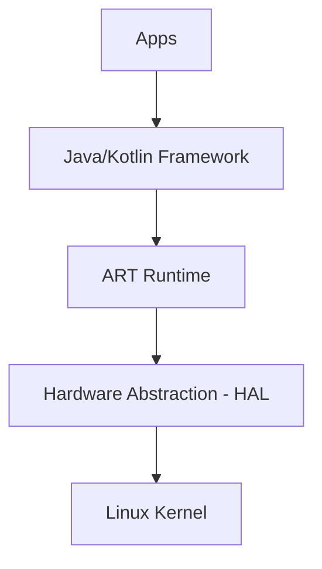

# Aula 01 - Introdução ao Mobile 📱

<!-- .slide: data-transition="zoom" -->

---

## Bem-vindo ao Mundo Mobile! 🌍

O mundo hoje é _mobile-first_.

* Mais acesso via smartphone que PC. { .fragment }
* Bilhões de dispositivos ativos. { .fragment }
* Ecossistema dinâmico e lucrativo. { .fragment }

---

## 🎯 Nossa Agenda de Hoje

1. Panorama do Mercado { .fragment }
2. Nativo vs Híbrido vs Web { .fragment }
3. Android vs iOS { .fragment }
4. Android Studio & Ferramentas { .fragment }
5. Por onde começar? { .fragment }

---

## 📱 1. Os Três Caminhos

Existem três formas principais de criar um App.

<!-- .slide: data-transition="slide-in fade-out" -->

---

### 🚀 Nativo

Desenvolvido na linguagem "mãe" da plataforma.

* **Android**: Kotlin / Java 🤖 { .fragment }
* **iOS**: Swift / Objective-C 🍎 { .fragment }
* **Vantagem**: Performance máxima e acesso total ao hardware. { .fragment }

---

### 🌐 Web (PWA)

Basicamente um site que se comporta como App.

* **Tecnologias**: HTML, CSS, JS.
* **Vantagem**: Custo baixo, funciona em tudo.
* **Desvantagem**: Performance limitada e pouco acesso ao hardware. { .fragment }

---

### 🧩 Híbrido / Cross-Platform

Usa um framework para gerar ambas as plataformas.

* **Exemplos**: Flutter, React Native.
* **Vantagem**: Uma base de código para dois apps.
* **Desvantagem**: Dependência de terceiros e overhead de performance. { .fragment }

---

## 🤖 2. O Gigante Verde: Android

O sistema operacional mais usado do planeta.

* Criado pelo Google. { .fragment }
* Baseado em **Linux**. { .fragment }
* Aberto e flexível. { .fragment }

---

### Arquitetura Android



---

## 🍎 3. O Pomar da Apple: iOS

Foco em luxo, fluidez e segurança.

* Criado pela Apple. { .fragment }
* Sistema Fechado (Darwin/Unix). { .fragment }
* Consumidores com alto poder aquisitivo. { .fragment }

---

### Android vs iOS 🆚

| Recurso | Android | iOS |
| :--- | :--- | :--- |
| **Linguagem** | Kotlin | Swift |
| **IDE** | Android Studio | Xcode |
| **Loja** | Google Play | App Store |
| **Taxa** | $25 (Única) | $99 (Anual) |

---

## 🛠️ 4. Sua Oficina: Android Studio

A ferramenta oficial para criar apps Android.

* Baseada no IntelliJ IDEA. { .fragment }
* Emulador integrado. { .fragment }
* Layout Editor visual. { .fragment }

<!-- .slide: data-background-color="#073b4c" -->

---

### ⚠️ Requisitos de Hardware

Para não passar raiva:

* **RAM**: 8GB (Mínimo) / 16GB (Sonho). { .fragment }
* **Disco**: SSD é OBRIGATÓRIO. { .fragment }
* **Processador**: i5 ou superior. { .fragment }

---

## 📂 5. Anatomia de um Projeto

O que tem dentro das pastas?

```termynal
$ ls -R app/src/main
AndroidManifest.xml
java/ # Código Fonte
res/  # Recursos (Imagens/Layouts)
```

---

### O Manifesto 📜

O arquivo `AndroidManifest.xml` é o "RG" do seu App.

* Nome do App. { .fragment }
* Quais telas existem (Activities). { .fragment }
* Quais permissões ele precisa (Internet, Câmera). { .fragment }

---

## 🧠 6. Por que Nativo?

Frameworks vêm e vão, mas o **Nativo** permanece.

> "Quem entende a base, não teme a mudança."

<!-- .slide: data-transition="convex" -->

---

## 🆚 Kotlin vs Swift

São linguagens "irmãs" na sintaxe!

```kotlin
// Kotlin
val nome = "Ricardo"
println("Olá $nome")
```

```swift
// Swift
let nome = "Ricardo"
print("Olá \(nome)")
```

---

## 🚀 Desafio de Hoje

1. Instalar o **Android Studio**. { .fragment }
2. Criar seu primeiro projeto "Empty Activity". { .fragment }
3. Mudar o texto do "Hello World" para seu nome. { .fragment }

---

## 🏁 Conclusão

* Mobile é o presente e o futuro. { .fragment }
* Escolher o caminho Nativo te dá superpoderes. { .fragment }
* Próxima aula: **Java para Android**. { .fragment }

---

## ❓ Dúvidas?

Siga para o canal oficial da disciplina no Teams!

---

### Fim da Aula 01 👋
