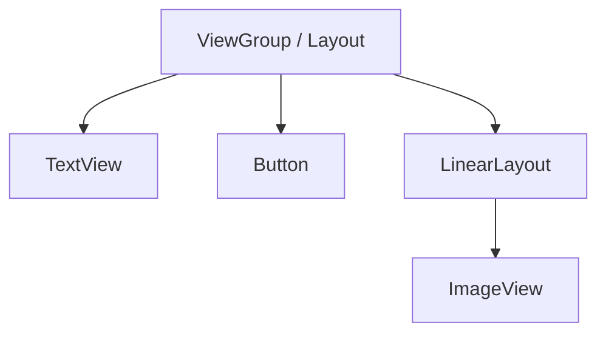

# Aula 05 - Interface Gráfica (UI) 🎨

<!-- .slide: data-transition="convex" -->

---

## 🏗️ A Hierarquia de Views

No Android, tudo o que você vê é baseado em uma árvore de elementos.



---

## 🧱 Views vs ViewGroups

* **View**: O átomo da interface (Botão, Campo de Texto, Imagem). { .fragment }
* **ViewGroup**: O esqueleto que organiza os átomos (LinearLayout, ConstraintLayout). { .fragment }

---

## 📏 Unidades: dp vs sp

Regra de ouro: NUNCA use `px`.

* **dp** (Density-independent Pixels): Para tamanhos e margens. { .fragment }
* **sp** (Scale-independent Pixels): Para textos. { .fragment }

---

## 📐 LinearLayout

O mais simples. Organiza itens em fila.

* **Vertical**: Um abaixo do outro. { .fragment }
* **Horizontal**: Um ao lado do outro. { .fragment }
* **Peso (layout_weight)**: Útil para preencher espaço proporcionalmente. { .fragment }

---

## ⚓ ConstraintLayout

O padrão da indústria moderna.

* Baseado em restrições (amarras). { .fragment }
* Evita aninhamento de layouts (performance 🚀). { .fragment }
* Flexível e responsivo para qualquer tamanho de tela. { .fragment }

<!-- .slide: data-transition="slide-in fade-out" -->

---

### Exemplo: Botão centralizado

```xml
<Button
    android:id="@+id/btnCentro"
    app:layout_constraintTop_toTopOf="parent"
    app:layout_constraintBottom_toBottomOf="parent"
    app:layout_constraintStart_toStartOf="parent"
    app:layout_constraintEnd_toEndOf="parent" />
```

---

## 🖼️ ImageView & Drawable

Como exibir imagens?

* Use vetores (SVG -> Vector Drawable) sempre que possível. { .fragment }
* Formatos bitmap (PNG/JPG) aumentam o tamanho do app. { .fragment }
* Escala: `scaleType="centerCrop"` vs `fitCenter`. { .fragment }

---

## ⌨️ Entrada de Dados: EditText

* Use `inputType="textPassword"` para senhas. { .fragment }
* Use `inputType="emailAddress"` para teclados customizados. { .fragment }
* Dica: `TextInputLayout` (Material Design) dá um visual premium. { .fragment }

---

## 💅 Temas e Estilos

Não repita código! Centralize o estilo.

```xml
<style name="BotaoRosa">
    <item name="android:backgroundTint">@color/pink</item>
</style>
```

---

## 🆚 Android XML vs iOS Auto Layout

| Recurso | Android | iOS |
| :---: | :---: | :--- |
| **Pai** | ViewGroup | UIView |
| **Logic** | Layout Params | Constraints |
| **Unidade** | dp | points |
| **Arquivo** | .xml | .storyboard / .xib |

---

## 🔗 ViewBinding na Prática

Adeus `findViewById`!

```kotlin
// Inicialização no onCreate
binding = ActivityMainBinding.inflate(layoutInflater)
setContentView(binding.root)

// Uso
binding.btnSalvar.setOnClickListener { ... }
```

<!-- .slide: data-background-color="#1b4332" -->

---

## 🖱️ Eventos de Clique

```kotlin
binding.myButton.setOnClickListener {
    Toast.makeText(this, "Clicou!", Toast.LENGTH_SHORT).show()
}
```

---

## ♿ Acessibilidade

O Android deve ser para todos.

* **contentDescription**: OBRIGATÓRIO para imagens (leitores de tela). { .fragment }
* **Cores**: Contraste adequado. { .fragment }
* **Tamanhos**: Botões com pelo menos 48dp de área de toque. { .fragment }

---

## 🛠️ Desafio da Aula: Tela de Cadastro

Crie uma tela com:
1. Nome (EditText) { .fragment }
2. E-mail (EditText) { .fragment }
3. Senha (Password) { .fragment }
4. Botão "Salvar" { .fragment }
5. Use **ConstraintLayout** para posicionar tudo. { .fragment }

---

## 🧪 Preview de Layout

O Android Studio permite testar seu layout em diferentes dispositivos (Pixel, Tablets, Dobráveis) sem rodar o app.

* Use a aba **Design** para ajustes rápidos. { .fragment }
* Use a aba **Attributes** para mudar propriedades sem digitar XML. { .fragment }

---

## 🏁 Conclusão

* Design atrativo retém usuários. { .fragment }
* ViewBinding é o padrão moderno de conexão. { .fragment }
* ConstraintLayout é sua ferramenta mais potente. { .fragment }

---

## ❓ Dúvidas?

---

### Próxima Aula: Navegação entre Telas! 🗺️👋
