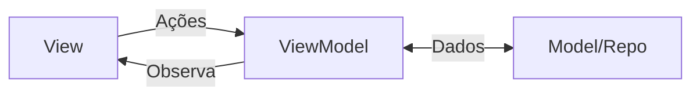

# Aula 07 - Arquitetura MVVM 🏗️

<!-- .slide: data-transition="zoom" -->

---

## 🦸 O Problema da God Activity

Sua Activity faz tudo?
* Chama a internet. { .fragment }
* Valida campos. { .fragment }
* Salva no banco. { .fragment }
* Desenha a tela. { .fragment }

> Isso é um pesadelo de manutenção! 😱

---

## 📐 O Padrão MVVM

Recomendado pelo Google (Android Jetpack).

* **Model**: Dados e Lógica de Negócio. { .fragment }
* **View**: UI (Activity/XML). Burra e Visual. { .fragment }
* **ViewModel**: O cérebro. Faz a ponte entre os dois. { .fragment }

---

### O Fluxo de Dados



---

## 🧠 O ViewModel

Seu maior superpoder: **Sobrevivência**.

* Quando você gira a tela, a Activity morre e renasce. { .fragment }
* O ViewModel **permanece** vivo na memória. { .fragment }
* Os dados não são perdidos! 💎 { .fragment }

<!-- .slide: data-background-color="#1e1e24" -->

---

## 📡 LiveData

O mensageiro que respeita a vida.

* É um container de dados observável. { .fragment }
* A View diz: "Me avise quando o dado mudar". { .fragment }
* Se a View estiver em background, o LiveData espera ela voltar para avisar. { .fragment }

---

### Exemplo de LiveData

```kotlin
// No ViewModel
val nome = MutableLiveData<String>()

fun carregar() {
    nome.value = "Ricardo"
}
```

```kotlin
// Na Activity
viewModel.nome.observe(this) { novoNome ->
    binding.txtNome.text = novoNome
}
```

---

## 🏗️ Camada Model & Repository

Não deixe o ViewModel saber de ONDE vêm os dados.

* O **Repository** decide: "Vou buscar na Internet ou no Banco local?" { .fragment }
* O ViewModel apenas pede: "Me dê a lista de usuários". { .fragment }

---

## 🆚 MVVM vs Outros

| Padrão | Característica |
| :--- | :--- |
| **MVC** | Controller fica sobrecarregado. |
| **MVP** | Presenter e View muito acoplados. |
| **MVVM** | View observa o ViewModel (Desacoplado). |

---

## 🧪 Benefícios para Testes

Testar UI é lento e caro.
Testar lógica no ViewModel é **fast & cheap**. ⚡

> Com MVVM, você testa a lógica sem precisar abrir o emulador.

---

## 🧬 Data Binding (Avançado)

Imagine ligar o dado do ViewModel direto no XML.

```xml
<TextView
    android:text="@{viewModel.userName}" />
```

* Menos `binding.textView.text = ...` na Activity. { .fragment }
* Código mais limpo. { .fragment }

<!-- .slide: data-transition="convex" -->

---

## 🛠️ Prática da Aula: Contador MVVM

1. Crie uma Activity com um botão e um texto. { .fragment }
2. Crie um `MainViewModel` com um `counter: MutableLiveData<Int>`. { .fragment }
3. No clique, chame `counter.value = (counter.value ?: 0) + 1`. { .fragment }
4. Observe o contador na Activity. { .fragment }

---

### O Segredo da Rotação 🔄

Teste seu app:
1. Clique 5 vezes (Contador = 5).
2. Gire o celular.
3. Se o contador continuar em 5, você implementou MVVM corretamente! ✅

---

## 🆚 MVVM no iOS

No iOS moderno usamos **@StateObject** e **@Published**.

```swift
class UserViewModel: ObservableObject {
    @Published var name = "Ricardo"
}
```

> O conceito de "Reatividade" é o mesmo!

---

## 📊 Vantagens Reais

* **Manutenibilidade**: Código organizado por pastas. { .fragment }
* **Escalabilidade**: Fácil adicionar novas telas. { .fragment }
* **Performance**: UI Thread fica livre para animações. { .fragment }

---

## 🏁 Conclusão

* Não seja um refém da `MainActivity`. { .fragment }
* Use o ViewModel para guardar o estado. { .fragment }
* Deixe o LiveData atualizar sua tela. { .fragment }

---

## ❓ Dúvidas?

---

### Próxima Aula: Persistência de Dados (Room)! 💾👋
