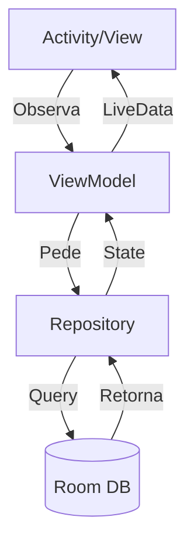

# Aula 08 - Persistência de Dados 💾

<!-- .slide: data-transition="slide" -->

---

## 💾 Onde guardamos os dados?

Apps precisam lembrar das coisas quando fechados.

* Configurações simples. { .fragment }
* Listas complexas. { .fragment }
* Arquivos multimídia. { .fragment }

---

## 1. SharedPreferences 🔑

A forma mais simples: Chave e Valor.

* "nome" -> "Ricardo" { .fragment }
* "notificacoes_on" -> true { .fragment }
* "tema" -> 1 { .fragment }

---

### Usando PreferenceManager

```kotlin
val prefs = getSharedPreferences("config", MODE_PRIVATE)

// Gravar
prefs.edit().putString("USER", "Android").apply()

// Ler
val user = prefs.getString("USER", "Ninguém")
```

> **Atenção**: Não use para dados grandes ou listas!

---

## 🏛️ Banco de Dados: SQLite

O Android tem o SQLite no seu coração.

* Banco Relacional. { .fragment }
* Leve e embutido. { .fragment }
* Mas... o código puro é horrível (SQL strings). { .fragment }

---

## 🔨 Conheça o ROOM

A biblioteca do Jetpack que salva vidas.

1. **Entity**: Sua tabela (Classe de dados). { .fragment }
2. **DAO**: Seus comandos (Queries). { .fragment }
3. **Database**: O gerente do banco. { .fragment }

<!-- .slide: data-transition="convex" -->

---

### Passo 1: A Entidade (@Entity)

```kotlin
@Entity
data class User(
    @PrimaryKey val id: Int,
    val name: String
)
```

---

### Passo 2: O DAO (@Dao)

```kotlin
@Dao
interface UserDao {
    @Insert
    void save(User user)

    @Query("SELECT * FROM User")
    LiveData<List<User>> getAll()
}
```

---

## 🧵 A Regra de Ouro do Banco

**NUNCA** acesse o banco na Main Thread.

* O Room vai travar seu app (Crash) se você tentar. { .fragment }
* Use **Coroutines** ou **LiveData**. { .fragment }
* Por que? Porque ler o disco é lento e trava a tela. { .fragment }

---

## 🧬 Ciclo Completo: MVVM + Room



---

## 📂 Arquivos Externos

Para fotos e vídeos.

* **Cache**: Temporário. { .fragment }
* **Arquivos Privados**: Só seu app vê. { .fragment }
* **Arquivos Públicos**: Galeria, Downloads (Precisa de permissão). { .fragment }

---

## 🆚 Persistência: Android vs iOS

| Recurso | Android | iOS |
| :---: | :---: | :--- |
| **Simples** | SharedPreferences | UserDefaults |
| **Banco** | Room (SQLite) | Core Data / SwiftData |
| **Arquivos** | Scoped Storage | Sandbox |

---

## 🕵️ Ferramenta: App Inspection

No Android Studio, você pode ver o banco de dados **ao vivo**.

1. Rode o app. { .fragment }
2. Aba `App Inspection` -> `Database Inspector`. { .fragment }
3. Você pode editar os dados e ver a tela do celular mudar! 🎩 { .fragment }

<!-- .slide: data-background-color="#003049" -->

---

## 🛠️ Prática: Lista de Tarefas

Vamos criar um banco para salvar textos.

1. Configure o Room no `build.gradle`. { .fragment }
2. Crie a Entity `Task`. { .fragment }
3. Salve um texto vindo de um `EditText`. { .fragment }

---

### Dica: O Singleton do Banco

Não crie várias instâncias do banco. Use o padrão **Singleton**.

```kotlin
val db = Room.databaseBuilder(
    applicationContext,
    AppDatabase::class.java, "database-name"
).build()
```

---

## 🏁 Conclusão

* Escolha a ferramenta certa para o dado certo. { .fragment }
* Room é o padrão para dados estruturados. { .fragment }
* Sempre use threads de background (IO). { .fragment }

---

## ❓ Dúvidas sobre Dados?

---

### Próxima Aula: Listas com RecyclerView! 📋👋
