# Aula 12 - UX e Material Design 3 🎨

<!-- .slide: data-transition="zoom" -->

---

## 💄 O que é Material Design?

O sistema de design do Google.

* Criado em 2014. { .fragment }
* Inspirado em papel e tinta. { .fragment }
* Agora na versão 3: **Material You**. { .fragment }

---

## 🌸 Material You (M3)

A personalização elevada ao máximo.

* **Cores Dinâmicas**: O app suga as cores do papel de parede do usuário. { .fragment }
* **Acessibilidade**: Foco em contraste e tamanhos de toque. { .fragment }
* **Expressividade**: Formas orgânicas e arredondadas. { .fragment }

---

## 📐 O Grid de 8dp

No Android, medimos tudo em múltiplos de 8.

* 8, 16, 24, 32, 40... { .fragment }
* Isso garante alinhamento harmônico em qualquer tela. { .fragment }
* Regras de margem e padding seguem esse padrão. { .fragment }

---

## 🔘 Componentes Modernos

---

### 1. FAB (Floating Action Button)

O botão que "flutua" sobre o conteúdo.

* Representa a ação principal. { .fragment }
* Ex: Criar novo e-mail, Adicionar tarefa. { .fragment }

---

### 2. Cards 🃏

Agrupam informações relacionadas.

* Elevação (sombras). { .fragment }
* Bordas arredondadas (12dp a 28dp). { .fragment }

---

### 3. Bottom Navigation 🧭

Navegação principal ao alcance do polegar.

* Entre 3 e 5 destinos. { .fragment }
* Ideal para uso com uma mão só. { .fragment }

---

## 🌑 Dark Mode: Não é opcional!

O usuário ama o tema escuro.

* Economia de bateria (telas OLED). { .fragment }
* Descanso visual à noite. { .fragment }
* **Como fazer**: Pasta `values-night/colors.xml`. { .fragment }

<!-- .slide: data-background-color="#121212" -->

---

## 🆚 Material (Android) vs HIG (iOS)

| Característica | Android (Material) | iOS (HIG) |
| :--- | :--- | :--- |
| **Foco** | Elevação / Camadas | Transparência / Blur |
| **Botões** | FAB / Sombreados | Flat / Bordas finas |
| **Navegação** | Drawer / Bottom Nav | Tab Bar Superior/Inferior |
| **Espírito** | Papel e Tinta | Vidro e Minimalismo |

---

## 🔡 Tipografia: Roboto e Além

A fonte oficial do Android.

* Use pesos variados para criar hierarquia. { .fragment }
* Título: Bold / Grande. { .fragment }
* Corpo: Regular / 14sp ou 16sp. { .fragment }

---

## 🌊 Feedback Visual (Ripples)

"O app está me ouvindo?"

* Sempre que o usuário tocar, algo deve acontecer. { .fragment }
* Efeito **Ripple** (Onda) é o padrão. { .fragment }

---

## 🛠️ Prática: Estilizando com M3

1. No `build.gradle`, use Material 1.9.0+. { .fragment }
2. No XML, troque `Button` por `MaterialButton`. { .fragment }
3. Teste o atributo `app:cornerRadius` e veja a mudança. { .fragment }

---

## 🧬 Mermaid: Camadas UI

```mermaid
graph TD
    A[Barra de Status]
    B[Barra de App - TopAppBar]
    C[Conteúdo - RecyclerView]
    D[Botão Flutuante - FAB]
    E[Barra Inferior - BottomNav]
    A --> B
    B --> C
    C --> D
    D --> E
```

---

## 🧠 UX: Experiência do Usuário

UX não é só "bonito", é "funcional".

* **Velocidade**: Carregamento rápido. { .fragment }
* **Clareza**: Icons autoexplicativos. { .fragment }
* **Prevenção**: Não deixe o usuário errar (validações). { .fragment }

---

## 🏁 Conclusão

* Design ruim mata apps bons. { .fragment }
* Siga o grid de 8dp. { .fragment }
* Pense sempre na acessibilidade (Content Description!). { .fragment }

---

## ❓ Perguntas sobre Visual?

---

### Próxima Aula: Sensores e Hardware! 📸👋
